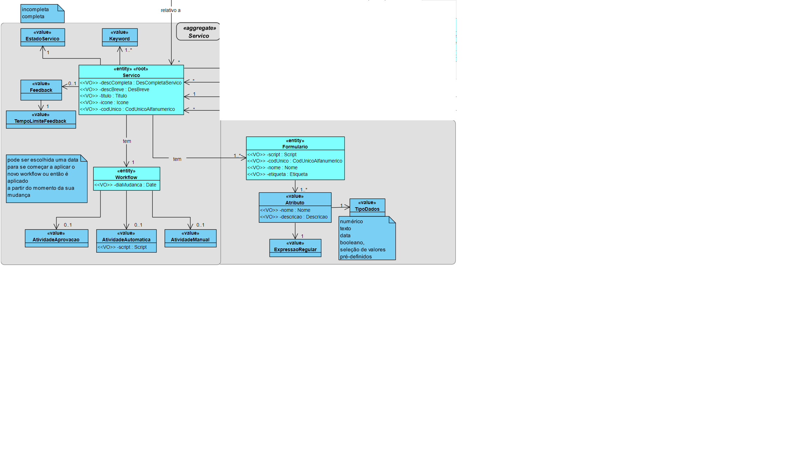
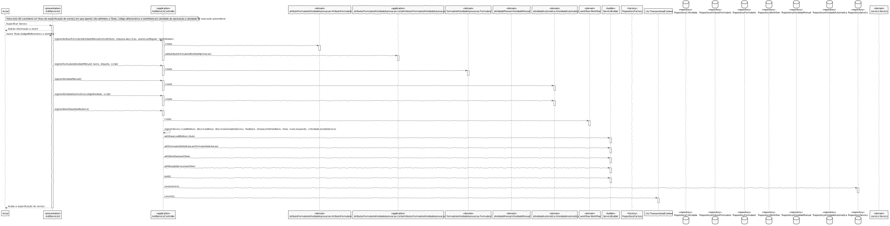
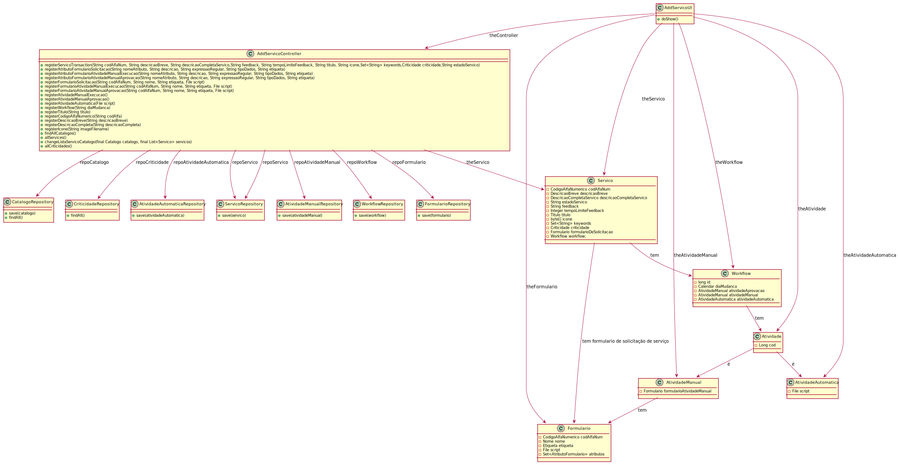
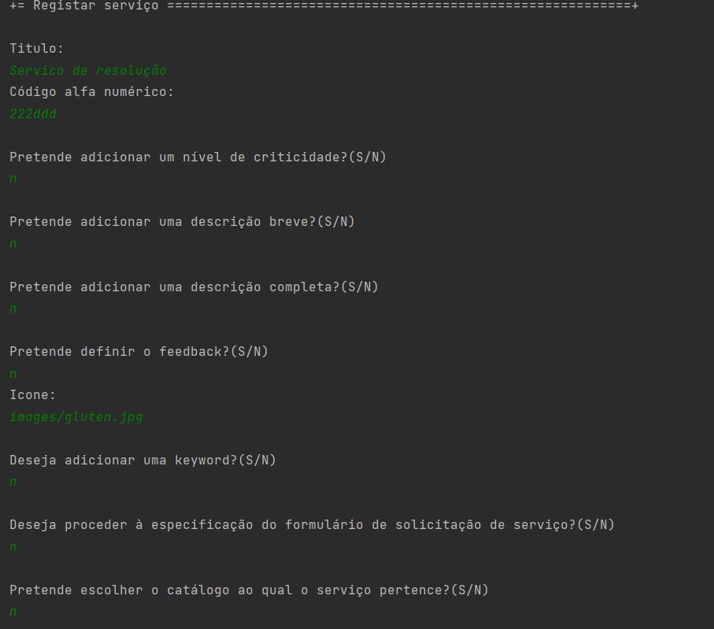

# US2002a
=======================================

# 1. Requisitos

**US2002a**: Como GSH, eu pretendo proceder à especificação de um novo serviço, devendo o sistema permitir que a mesma fique incompleta e seja, posteriomente, retomada.

 Como Gestor de Serviços de Helpdesk pretendo :

 - Proceder à especificação de um serviço

 - Guardar um rascunho da especificação deste serviço de modo a que mais tarde possa ser alterado

# 2. Análise

A especificação de um novo serviço é realizada por um Gestor de Serviços Helpdesk (GSH) e implica a introdução das informações base do serviço, sendo estas o código, descrição, catálogo onde será disponibilizado, formulários e também se este serviço requer feedback.
Também serão especificados os tipo de dados a considerar nos formulários : Inteiro, String, Bool, Data, Ficheiro, ListaDeValores (Enumerado).

# 3. Design

## 3.1. Realização da Funcionalidade

O SD será semelhante ao da US2003.

## 3.2. Diagrama de Classes

O CD será semelhante ao da US2003.

## 3.3. Padrões Aplicados

- Controller

- Creator

- Builder

- Repository

- Factory

- Persistence Context

## 3.4. Testes

**Teste 1:** Verificar que não é possível criar uma instância da classe Servico sem o CodigoAlfaNumerico obedecer às regras de negócio.

	@Test(expected = IllegalArgumentException.class)
	public boolean ensureCodigoAlfaNumericoMeetsRequirements(String codAlfaNum){
			if(codAlfaNum.length() > 15 || !codAlfaNum.matches(^(?=.*[a-zA-Z])(?=.*[0-9])[A-Za-z0-9]+$) ){
				return false;
			}else{
				return true;
			}
	}
**Teste 2:** Verificar que não é possível criar uma instância da classe Servico sem a descricaoBreve obedecer às regras de negócio.

	@Test(expected = IllegalArgumentException.class)
	public boolean ensureDescricaoBreveMeetsRequirements(String descricaoBreve){
			if(descricaoBreve.length() > 40){
				return false;
			}else{
				return true;
			}
	}

**Teste 3:** Verificar que não é possível criar uma instância da classe Servico sem a descricaoCompleta obedecer às regras de negócio.

  	@Test(expected = IllegalArgumentException.class)
  	public boolean ensureDescricaoCompletaMeetsRequirements(String descricaoCompleta){
  			if(descricaoCompleta.length() > 500){
  				return false;
  			}else{
  				return true;
  			}
  	}

**Teste 4:** Verificar que não é possível criar uma instância da classe Servico sem o Titulo obedecer às regras de negócio.

      @Test(expected = IllegalArgumentException.class)
      public boolean ensureTituloMeetsRequirements(String titulo){
          if(titulo.length() > 50){
            return false;
          }else{
            return true;
          }
      }

# 4. Implementação

# 5. Integração/Demonstração

De modo a integrar esta UC no projeto foi necessário estar a par do desenvolvimento de outras funcionalidades tais como o registo dos catálogos e a definição das criticidades.

# 6. Observações

Esta UC ficou devidamente realizada(faltando a transação) podendo vir a sofrer alterações no que toca a validações dos atributos do Serviço e também no que concerne a especificação do script de validação do formulário.
