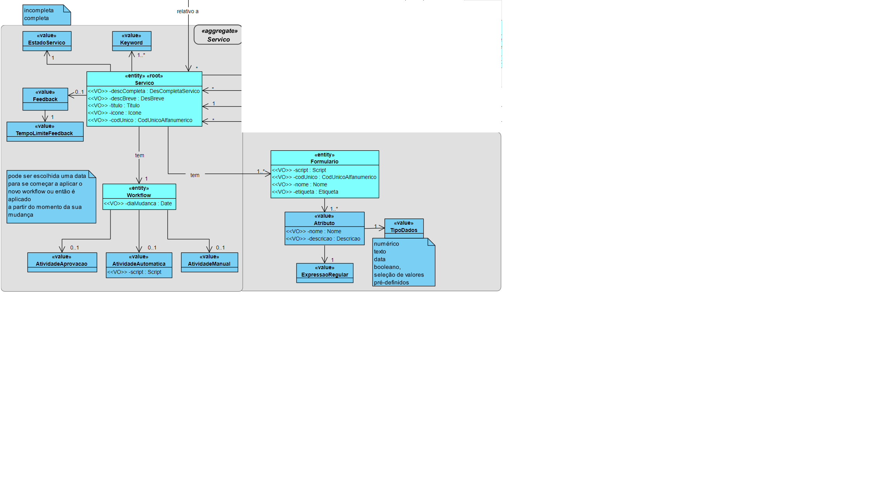
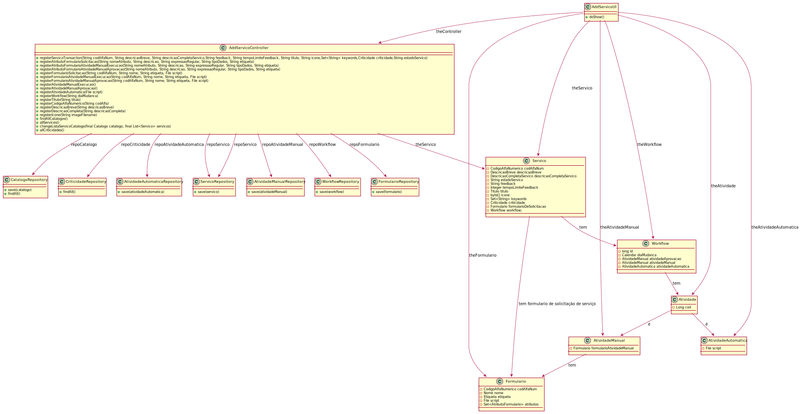
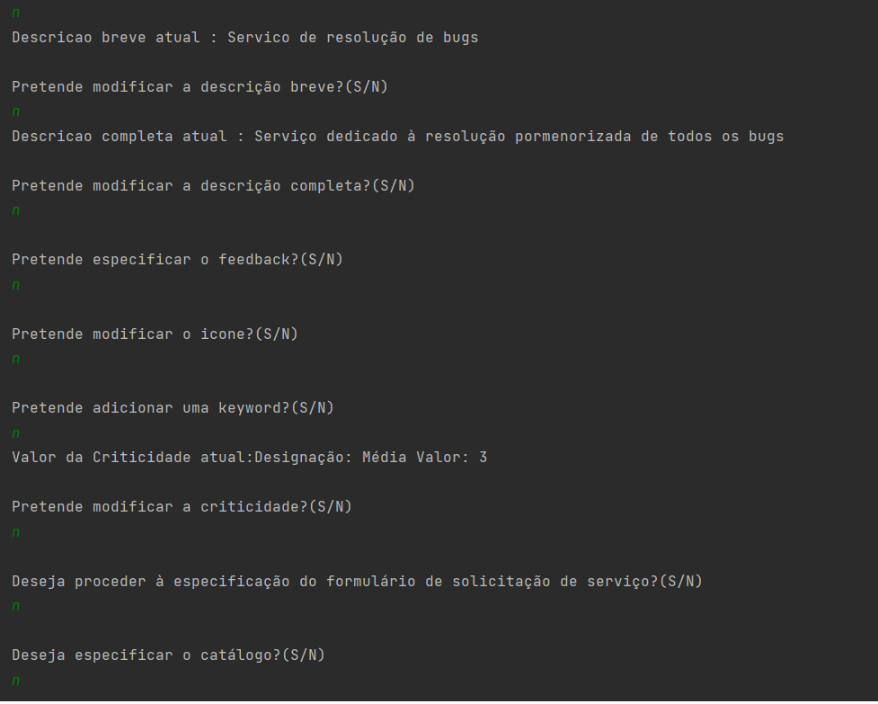

# US2002b
=======================================

# 1. Requisitos

**US2002b**: Como GSH, eu pretendo proceder à continuação da especificação de um serviço.

# 2. Análise

  Continuação da especificação de um serviço.

  

# 3. Design

## 3.1. Realização da Funcionalidade

O SD será semelhante ao da US2003.

## 3.2. Diagrama de Classes

O CD será semelhante ao da US2003.

## 3.3. Padrões Aplicados

- Controller

- Creator

- Builder

- Repository

- Factory

- Persistence Context

## 3.4. Testes

  Este UC terá testes semelhantes à UC de especificação de serviço.

# 4. Implementação

# 5. Integração/Demonstração

De modo a integrar esta UC no projeto foi necessário estar a par do desenvolvimento de outras funcionalidades tais como o registo dos catálogos e a definição das criticidades.

# 6. Observações

Esta UC ficou devidamente realizada(faltando a transação) podendo vir a sofrer alterações no que toca a validações dos atributos do Serviço e também no que concerne a especificação do script de validação do formulário.
