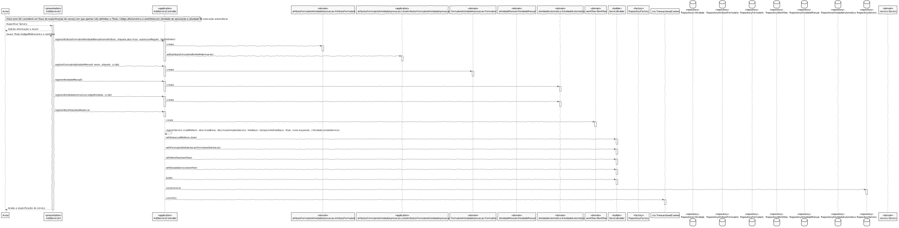

# US2003
=======================================

# 1. Requisitos

**US2003**: Como GSH, eu pretendo continuar/completar a especificação em curso de um serviço.
O serviço só deve ficar disponível para solicitação quando a sua especificação ficar completa e válida.
Adição de fluxos de atividade e validações dos formulários.

# 2. Análise

  

# 3. Design

## 3.1. Realização da Funcionalidade

  

## 3.2. Diagrama de Classes

## 3.3. Padrões Aplicados

- Controller

- Creator

- Builder

- Repository

- Factory

- Persistence Context

## 3.4. Testes

  Este UC terá testes semelhantes à UC de especificação de serviço.

# 4. Implementação

# 5. Integração/Demonstração

De modo a integrar esta UC no projeto foi necessário estar a par do desenvolvimento de outras funcionalidades tais como o registo dos catálogos e a definição das criticidades.

# 6. Observações

Esta US está devidamente implementada podendo vir a ser adicionadas novas validações.
