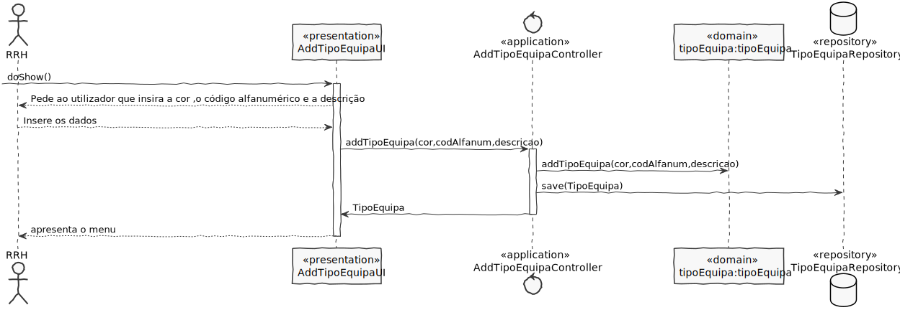

# US2054
=======================================

# 1. Requisitos

**US2054**: Como RRH, eu pretendo registar um novo tipo de equipa.

 A interpretação feita deste requisito foi no sentido de especificar no sistema um novo tipo de equipa, de modo a que este possa, posteriormente, ser associado a uma ou mais equipas.

# 2. Análise

A especificação de um novo tipo de equipa é realizada por um Responsável de Recursos Humanos(RRH) e implica a introdução das informações base do tipo de equipa, sendo estas a cor, o código único alfanumérico e uma descrição.

# 3. Design

## 3.1. Realização da Funcionalidade

## 3.2. Diagrama de Classes

## 3.3. Padrões Aplicados

- Controller

- Creator

- Repository

- Factory

- Persistence Context

## 3.4. Testes

**Teste 1:** Verificar que não é possível criar uma instância da classe TipoEquipa sem o CodigoAlfaNumerico obedecer às regras de negócio.

	@Test(expected = IllegalArgumentException.class)
	public boolean ensureCodigoAlfaNumericoMeetsRequirements(String codAlfaNum){
			if(codAlfaNum.length() > 15 || !codAlfaNum.matches(^(?=.*[a-zA-Z])(?=.*[0-9])[A-Za-z0-9]+$) ){
				return false;
			}else{
				return true;
			}
	}

**Teste 2:** Verificar que não é possível criar uma instância da classe TipoEquipa sem a descricao obedecer às regras de negócio.

	@Test(expected = IllegalArgumentException.class)
	public boolean ensureDescricaoMeetsRequirements(String descricao){
			if(descricao.length() > 50){
				return false;
			}else{
				return true;
			}
	}

**Teste 3:** Verificar que não é possível criar uma instância da classe TipoEquipa sem a cor obedecer às regras de negócio.

  	@Test(expected = IllegalArgumentException.class)
  	public boolean ensureCorMeetsRequirements(String cor){
  			if(cor.matches("#([A-F]|[0-9]){6}")){
  				return false;
  			}else{
  				return true;
  			}
  	}
# 4. Implementação

# 5. Integração/Demonstração

  Esta funcionalidade foi integrada facilmente pois não envolvia dependências com outras entidades do Domínio.

# 6. Observações

 Esta UC ficou devidamente realizada podendo vir a sofrer alguma alteração no que toca à validação dos atributos do TipoEquipa.
