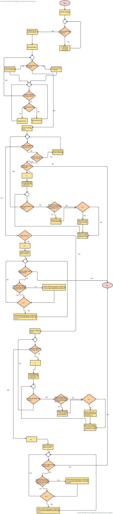

# US4072  - Atribuição de tarefas automaticamente
==================================================================

# 1. Requisitos

**US 4072:**

* Como Gestor de Projeto, eu pretendo que seja desenvolvido e integrado no Motor de Fluxos de Atividades algoritmos que assignem automaticamente tarefas a colaboradores de forma a evitar que essas tarefas tenham que ser reivindicadas pelos mesmos.

# 2. Implementação

De seguida apresentamos um fluxograma do primeiro algoritmo:

# 3. Teste de velocidade

* O **código** de Teste de Velocidade encontra-se na Classe **TcpCliMotorTesteVelocidadeAtribuicaoTarefa** (HelpdeskService/helpdesk.app.motorDeFluxos/src/main/java/eapli/helpdesk/app/MotorDeFluxos/TcpMotor/TcpCliMotorTesteVelocidadeAtribuicaoTarefa.java)
* Em **média** demora cerca de **6 segundos** a executar a atribuição de **1** tarefa .
* **Exemplo de Output** do Teste de Velocidade: ***[INFO] O Algoritmo de Atribuição de Tarefas 1 demorou 6 segundos a atribuir a tarefa***

# 4. Integração/Demonstração

* Esta **US** está relacionada com a US de solicitação do serviço pois é no fim de cada solicitação que as tarefas são assignadas aos colaboradores.
