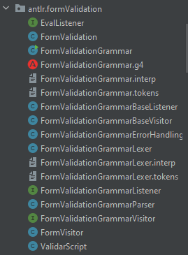
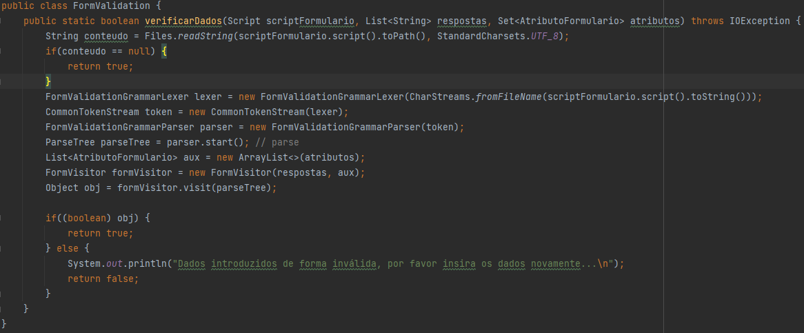
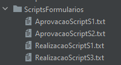

# US 1004 e 1007 - Desenvolvimento de Linguagem/Gramática de suporte geral ao sistema para expressar, entre outras coisas, validações de Formulários e capacitar o sistema de executar/interpretar os scripts especificados na linguagem/gramática desenvolvida.   
========================================================================================================================

# 1. Requisitos

**US1004 e 1007:**

* Como **Gestor de Projeto**, eu pretendo que seja desenvolvida uma **linguagem/gramática** de suporte geral ao sistema para expressar, entre outras coisas, validações de **formulários**.

* Como **Gestor de Projeto**, eu pretendo que o sistema seja capaz de **executar/interpretar** os scripts especificados na linguagem/gramática anteriormente desenvolvida.    

# 2. Explicação da nossa Linguagem/Gramática

---

### Gramática desenvolvida

```
grammar FormValidationGrammar;

start:
      | start ifCondition
      | start specs;

ifCondition: 'if' condicoes 'then' dados PONTO_E_VIRGULA;

statement :
            ifCondition
            | verify
            | specs
            ;

dados:
        dados condicoesDados
        | dados specs
        | dados ifCondition
        | ifCondition
        | specs
        | condicoesDados
        ;

specs:
        Inteiro 'tamanho: ' Inteiro PONTO_E_VIRGULA   #tamanhoValor
        | Inteiro 'esta entre ' intervalo             #valorEntre
        | Inteiro '-> ' Obrigatoriedade                #valorObrigatorio
        ;

intervalo: Inteiro 'e' Inteiro;

condicoesDados:
                 condicoes PONTO_E_VIRGULA
                 ;
condicoes:
            condicao
            | condicoes OperadorCondicional condicao PONTO_E_VIRGULA
            ;

verify:
          OperadorLogico
          | Igual_Diferente
          ;

condicao:
            Inteiro (OperadorLogico | Igual_Diferente) Inteiro   #valoresIguais
            | Inteiro ':' EstadoString                           #estadoValor
            | Inteiro Igual_Diferente condicaoString             #valorString
            | condicaoString Igual_Diferente Inteiro             #valorString1
            | Inteiro Igual_Diferente ValorBooleano              #valorBooleano
            | ValorBooleano Igual_Diferente Inteiro              #valorBooleano1
            ;

condicaoString:
                 stringEntreAspas
                 | valString
                 ;

stringEntreAspas:
                   '"'valString'"';

valString:
              String
              | String valString
              ;

valInt:   Inteiro
          | valInt Operador Inteiro
          ;

```

---

### Variáveis Utilizadas na Gramática desenvolvida

```
//------------------- VARIAVEIS -------------------

PONTO_E_VIRGULA: ';' ;

ValorBooleano: 'true' | 'false' ;
Tipo: 'Integer' | 'Real'| 'String' ;
EstadoString: 'preenchido' | 'vazio' ;
Obrigatoriedade: 'obrigatorio' | 'nao obrigatorio' ;

OperadorLogico: '<' | '>' | '<=' | '>=' ;
Igual_Diferente: '==' | '!=' ;
OperadorCondicional: '&&' | '||' ;
Operador: '+' | '-' | '*' | '/' ;

String: [A-Za-z]+ ;
Inteiro: [0-9]+ ;
WS : [ \t\r\n]+ -> skip ;
```

---

A nossa gramática possibilita então que:

* Sejam indicados os campos obrigatórios e não obrigatórios a serem preenchidos;

* Sejam indicadas condições (instruções if ... then ...), ou seja, caso um campo seja preenchido, outro campo qualquer passa a ser opcional;

* Além de verificação de obrigatoriedade de campos, também possibilita a verificação do tamanho de um campo, do intervalo em que se encontra o valor do campo;

* Possibilita a comparação de valores (Inteiros, Strings e Booleanos);

* Possibilita a cálculos matemáticos entre Inteiros;

* Possibilita a inserção de uma String sob a forma de "...", ou seja, String entre aspas.

## 2.1. Capacitar o sistema de executar/interpretar os scripts especificados na linguagem/gramática desenvolvida

Após a implementação da gramática ter sido concluída procedi à geração/criação das seguintes classes:



De modo a Capacitar o sistema de executar/interpretar os scripts especificados na linguagem/gramática desenvolvida para validação do formulário, procedi à criação de Visitors para a gramática.

Procedi então à criação da classe FormVisitor, onde nela criei os métodos de visita de instruções da gramática, bem como dos métodos definidos com "#...". Estes métodos deram então @Override aos métodos presentes na classe FormValidationGrammarBaseVisitor, uma vez que esta classe FormVisitor foi declarada como dando extends a essa mesma classe.

Além disso, criei a classe FormValidation, onde implementei o método designado nos apontamentos como parseWithVisitor, que designei como "verificarDados", que é chamado na UI da realização de tarefa, de forma a que o formulário preenchido seja validado através dos Visitors da gramática:



## 2.2. Estruturas de Exemplos de Scripts Válidos de acordo com a Gramática

Exemplos de Scripts Presentes no projeto utilizados na especificação de formulários de tarefas de aprovação e de resolução:



* RealizacaoScriptS1 (HelpdeskService/ScriptsFormularios/RealizacaoScriptS1.txt) - 9 primeiros campos todos obrigatórios de serem preenchidos à exceção do 10º atributo:

```
1 -> obrigatorio;
2 -> obrigatorio;
3 -> obrigatorio;
4 -> obrigatorio;
5 -> obrigatorio;
6 -> obrigatorio;
7 -> obrigatorio;
8 -> obrigatorio;
9 -> obrigatorio;
10 -> nao obrigatorio;
```

* AprovacaoScriptS2 (HelpdeskService/ScriptsFormularios/AprovacaoScriptS2.txt) - 1º campo obrigatório de ser preenchido, se o campo 2 for preenchido então o campo 3 não necessita de ser preenchido e se o campo 3 for preenchido então o campo 2 não necessita de ser preenchido:

```
1 -> obrigatorio;
if 2 : preenchido then 3 -> nao obrigatorio;
if 3 : preenchido then 2 -> nao obrigatorio;
```


# 3. Implementação

* A gramática encontra-se na Classe **FormValidationGrammar.g4** (HelpdeskService/helpdesk.core/src/main/java/eapli/helpdesk/antlr/formValidation/FormValidationGrammar.g4);

* O **código** de **validação dos scripts** da gramática ***FormValidationGrammar*** encontra-se na Classe **ValidarScript** (HelpdeskService/helpdesk.core/src/main/java/eapli/helpdesk/antlr/formValidation/ValidarScript.java);

* O **código** dos **Visitors** desenvolvidos da gramática ***FormValidationGrammar*** encontram-se na Classe **AutomaticTasksVisitor** (HelpdeskService/helpdesk.app.executorTarefasAutomaticas/src/main/java/eapli/helpdesk/app/executorTarefasAutomaticas/automaticsTaskScript/AutomaticTasksVisitor.java);

# 4. Integração/Demonstração

Estas USs 1004 e 1007 estão relacionadas com:

* A **US2003 (Continuar/completar a especificação em curso de um serviço)**, pois através da **gramática** vai ser possível **validar o script** inserido pelo utilizador

* A **US3023 (Realizar uma tarefa pendente)**, pois além da validação dos campos inseridos que efetuei através das expressões regulares dos atributos do formulário, o formulário preenchido será validado através da chamada do método já referido em cima (verificarDados), que por sua vez chama os Visitors da Gramática.

# 5. Observações

* **Commits** dados com referência à **US1004**, **US1007** e também alguns com referência à **US3023**, uma vez que havia uma ligação direta dessa US com esta.
