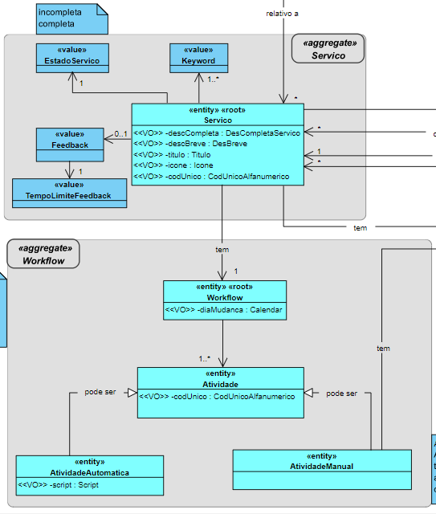
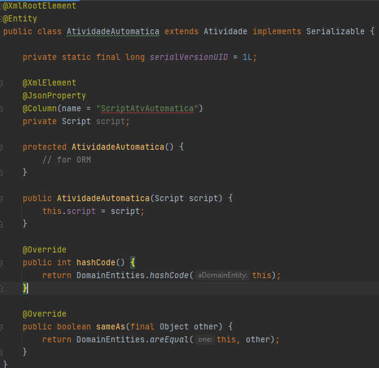

# US 1006 - Componente representativa de uma tarefa automática dedicada à execução de um script no âmbito de um pedido e adição desta à biblioteca de atividades típicas do sistema para, dessa forma, poder ser usada na definição de fluxos de atividades
=======================================

# 1. Requisitos

**US1006**:

- Como Gestor de Projeto, eu pretendo que seja desenvolvida a componente representativa de uma tarefa automática dedicada à execução de um script no âmbito de um pedido e que a mesma seja adicionada à biblioteca de atividades típicas do sistema para, dessa forma, poder ser usada na definição de fluxos de atividades.

- A interpretação feita deste requisito foi no âmbito desta US, foi no sentido de desenvolver no sistema a componente representativa de uma tarefa automática dedicada à execução de um script.

# 2. Análise

A componente representativa da tarefa automática vai utilizar um script para realizar uma manipulação dos dados que forem necessários.

## Excerto do Modelo de Domínio

# 3. Design

## 3.1. Realização da Funcionalidade

1. Esta US não deve ser vista como caso de uso onde há um ator e uma UI para realizar a mesma. Pelo contrário, note-se que quem aparece associado às US é o "Gestor de Projeto" que não é ator em nenhuma das aplicações em desenvolvimento.

2. Assim, a US corresponde a itens de trabalho de caracter mais técnico que visam permitir ao sistema como um todo (e não apenas à aplicação X ou Y) reconhecer e lidar com diferentes tipos de atividades. De momento, o sistema apenas precisa de reconhecer dois tipos de atividades (i) manual e (ii) automática baseada em script, estando nós, neste caso a falar sobre a automática.

## 3.2. Classes Utilizadas

- Atividade

- AtividadeAutomatica

- Script

# 4. Implementação

- Como representado na figura abaixo, procedi à criação da classe AtividadeAutomatica (representativa da especificação de uma atividade automática), que dá extends à superclasse Atividade, sendo que a AtividadeManual também o faz. Para a definição desta classe foi criada também a classe Script, sendo este um value object desta classe em questão, uma vez que se carateriza por ser realizada através deste.

# 5. Integração/Demonstração

* Esta US irá permitir representação de uma tarefa automática dedicada à execução de um script no âmbito de um pedido, ficando esta adicionada à biblioteca de atividades típicas do sistema para, dessa forma, poder ser usada na definição de fluxos de atividades.

# 6. Observações

* Esta US corresponde a itens de trabalho de caracter mais técnico que visam permitir ao sistema como um todo (e não apenas à aplicação X ou Y) reconhecer e lidar com este tipo de atividade (automática), pelo que não implicava criação de UI e Controller.
