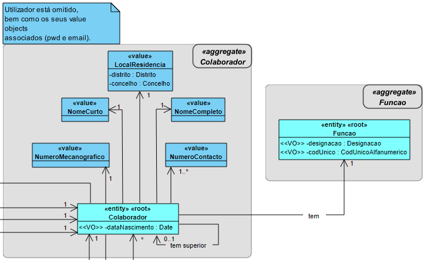
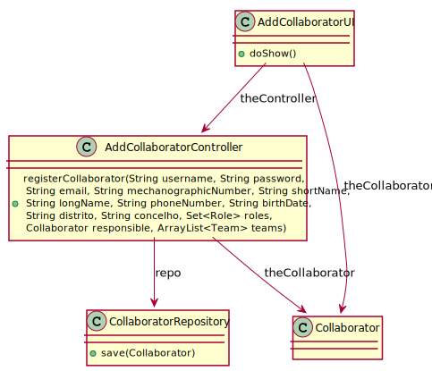
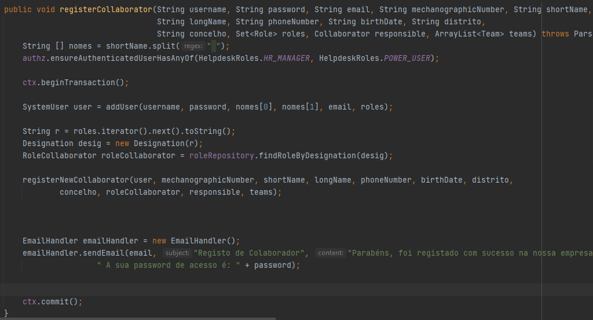

# US 2051 - Especificar um novo Colaborador
=======================================

# 1. Requisitos

**US2051**: Como Responsável de Recursos Humanos (RRH), eu pretendo proceder à especificação de um novo colaborador de modo a que este possa, posteriormente, aceder e usar o sistema.

A interpretação feita deste requisito foi no sentido de especificar no sistema um novo colaborador, de modo a que este possa, posteriormente, aceder e usar o sistema, podendo solicitar a realização de serviços, executar atividades de aprovação e/ou resolução de pedidos recebidos no sistema.

# 2. Análise

A especificação de um novo colaborador é realizada por um Responsável de Recursos Humanos (RRH) e implica a introdução do seu número mecanográfico, nome curto (i.e., pelo qual é comummente tratado), nome completo, data de nascimento, local de residência (distrito e conselho), endereço de email institucional, número de contacto (e.g. telemóvel, telefone), pela função que desempenha e, caso exista, pela indicação de quem é o seu responsável hierárquico atual na organização (i.e., outro colaborador). Além disso, deverá ser também introduzido um username em adição a estes. Algo que não é inserido pelo RRH, mas que fica também registado é a password e primeiro e último nome deste.

Relativamente à password, esta é gerada e enviada de seguida por email para o email inserido para o colaborador.

### Excerto Relevante do Modelo de Domínio

# 3. Design

Foi criado o controlador AddCollaboratorController que é responsável pelo  criação de um novo colaborador, bem como utilizador no sistema. Este controlador recorre à classe Collaborator para criar uma instância de colaborador. Para persistir esta informação no sistema é usado o padrão Repository. São usados CollaboratorRepository e UserRepository para guardar a informação em base de dados.

Tendo em conta que um colaborador pode ter um responsável RH e que pode ter uma função associada a si, é fornecida uma lista de funções para ser seleciona a sua função e uma lista  de colaboradores para ser selecionado o Responsável RH do colaborador.

## 3.1. Realização da Funcionalidade

A US procede-se da seguinte forma:

- É iniciado o processo de Especificação de uma novo Colaborador

- São solicitados dados a introduzir (username, email, número mecanográfico, nome Curto, nome Completo, número de contacto, data de nascimento, distrito) relativos ao colaborador

- O RRH introduz os dados

- De seguida é mostrada uma lista de funções

- O RRH seleciona a função que o colaborador irá desempenhar

- De seguida é mostrada uma lista de colaboradores (ou mais) de forma a que este possa selecionar um ou mais responsáveis hierárquicos

- O RRH seleciona colaboradores até este não pretender especificar mais nenhum responsável hierárquico

- De seguida é mostrada uma lista de equipas (ou mais) de forma a que este possa selecionar as equipas a que o colaborador pertence

- O RRH seleciona equipas até este não pretender indicar mais nenhuma equipa

- O colaborador é registado com sucesso, recebendo a password da sua conta por email, estando apto a aceder ao sistema

### SD

## 3.2. Diagrama de Classes

## 3.3. Padrões Aplicados

- Controller

- Creator

- Builder

- Repository

- Factory

- Persistence Context

- Transactional Context

## 3.4. Testes

**Teste 1 a 7:** Verificar que não é possível criar uma instância da classe Collaborator com valores nulos para o número mecanográfico, nome curto, nome completo, data de nascimento, local
de residência, endereço de email institucional, número de contacto.

	@Test(expected = IllegalArgumentException.class)
		public void ensureCollaboratorCantHaveNull<xField>() {
		Collaborator instance = new Collaborator(every field not null except xField);
	}

**Teste 8:** Verificar que não é possível criar uma instância da classe Collaborator sem o nome curto obedecer às regras de negócio.

	@Test(expected = IllegalArgumentException.class)
	public boolean ensureNomeCurtoMeetsCorrectSize(String nomeCurto){
			if(nomeCurto.lenth() > 30){
				return false;
			}else{
				return true;
			}
	}

**Teste 9:** Verificar que não é possível criar uma instância da classe Collaborator sem o nome completo obedecer às regras de negócio.

	@Test(expected = IllegalArgumentException.class)
	public boolean ensureNomeCompletoMeetsCorrectSize(String nomeCompleto){
			if(nomeCompleto.length() > 80){
				return false;
			}else{
				return true;
			}
	}

# 4. Implementação

#### Código realizado de forma a criar uma transação:

#### Aspetos importantes a referir:

- Foi utilizada a classe PasswordGenerator de modo a ser gerada uma palavra-passe que obedecesse aos critérios de validação da mesma.

- Foi utilizada a classe EmailHandler de modo a esta palavra-passe ser enviada por email para o colaborador que foi registado no sistema

- Para os Value Objects que estão submetidos a regras de negócio, foram criadas classes específicas para eles, de modo a estas regras serem validadas.

# 5. Integração/Demonstração

Na parte em que é feita a associação do colaborador a uma ou mais equipas, não é o Colaborador que contém uma lista de equipas, mas sim a Equipa que contém uma lista de Colaboradores. Assim sendo, quando é selecionada uma equipa, à lista de membros dessa equipa é que é adicionado o colaborador em questão, pelo que esta US apresenta de certa forma uma ligação à outra US desenvolvida por mim (USDemo3 - 2052).

# 6. Observações

*Nesta secção sugere-se que a equipa apresente uma perspetiva critica sobre o trabalho desenvolvido apontando, por exemplo, outras alternativas e ou trabalhos futuros relacionados.*
