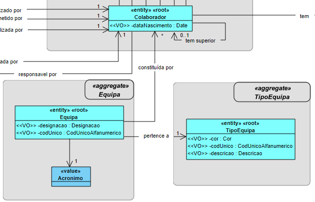
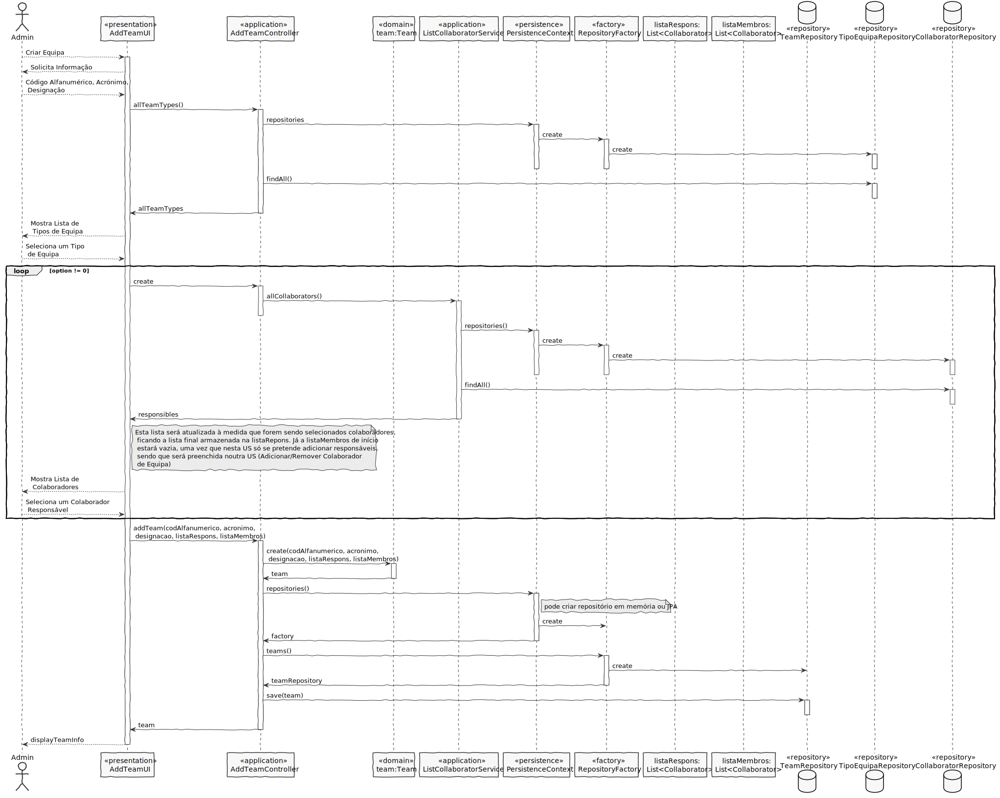
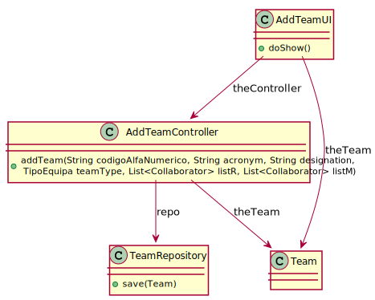
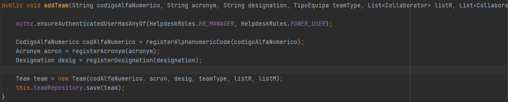

# US 2052 - Criar uma nova Equipa
=======================================

# 1. Requisitos

**US2052**: Como Responsável de Recursos Humanos (RRH), eu pretendo proceder à criação de uma nova equipa, que corresponde a um conjunto de colaboradores que num dado contexto pretende-se que sejam vistos/considerados/mencionados como um grupo.

A interpretação feita deste requisito foi no sentido de criar uma nova equipa. A esta nova equipa criada poderá ser associado um conjunto de colaboradores que num dado contexto serão vistos/considerados/mencionados como um grupo.

# 2. Análise

A especificação de uma nova equipa é realizada por um Responsável de Recursos Humanos (RRH) e implica a seleção do tipo de equipa em que esta se enquadra, indicação de um código único (alfanumérico), um acrónimo (também único) e uma designação. Além disso, esta equipa é caraterizada por ter um ou mais colaboradores responsáveis por ela.

### Excerto Relevante do Modelo de Domínio

# 3. Design

## 3.1. Realização da Funcionalidade

Uma parte do SD que representaria esta US seria idêntico ao da USDemo1, uma vez que esta consiste na introdução de dados, seleção de um tipo de equipa e seleção(ões) de colaborador(es).

A US procede-se da seguinte forma:

- É iniciado o processo de Criação de uma nova equipa

- São solicitados dados a introduzir (código alfanumérico, designação, acrónimo) relativos à equipa

- O RRH introduz os dados

- De seguida é mostrada uma lista dos tipos de equipa existentes de forma a que este possa selecionar um tipo

- O RRH seleciona o tipo de equipa que pretende

- De seguida é mostrada uma lista de colaboradores de forma a que este possa selecionar um ou mais responsáveis pela equipa

- O RRH seleciona colaboradores até este não pretender adicionar mais nenhum responsável à equipa, pelo que a cada seleção a lista é atualizada de forma coerente

- A equipa é registada com sucesso

Para esta US procedi então ao registo da equipa através do método save para o TeamRepository, sendo que além deste repositório foi também utilizado o CollaboratorRepository, uma vez que foi necessário ter acesso a colaboradores do sistema, bem como o TipoEquipaRepository, de modo a ter acesso aos tipos de equipa existentes

### SD

## 3.2. Diagrama de Classes

## 3.3. Padrões Aplicados

- Controller

- Creator

- Repository

- Factory

- Persistence Context

## 3.4. Testes

**Teste 1**: Verificar que não é possível criar uma instância da classe Equipa sem o CodigoAlfaNumérico obedecer às regras de negócio.

	@Test(expected = IllegalArgumentException.class)
	public boolean ensureCodigoAlfaNumericoMeetsRequirements(String codAlfaNum){
				if(!codAlfaNum.matches("^(?=.*[a-zA-Z])(?=.*[0-9])[A-Za-z0-9]+$")||StringPredicates.isNullOrEmpty(codAlfaNum)||codAlfaNum.length()>15){
						return false;
				}else{
						return true;
				}
	}

**Teste 2**: Verificar que não é possível criar uma instância da classe Equipa sem a descrição obedecer às regras de negócio.

	@Test(expected = IllegalArgumentException.class)
	public boolean ensureDescricaoMeetsRequirements(String descricao){
	        if(descricao.length()>50 || StringPredicates.isNullOrEmpty(descricao)){
	            return false;
	        }else{
	            return true;
	        }
	}

**Teste 3**: Verificar que não é possível criar uma instância da classe Equipa sem a descrição obedecer às regras de negócio.

		@Test(expected = IllegalArgumentException.class)
		public boolean ensureAcronymMeetsRequirements(String acronym){
		        if(!acronym.matches("^(?=.*[a-zA-Z])(?=.*[0-9])[A-Za-z0-9]+$")|| StringPredicates.isNullOrEmpty(acronym)
                || acronym.length()>10){
		            return false;
		        }else{
		            return true;
		        }
		}

# 4. Implementação

#### Representação do método addTeam() implementado

# 5. Integração/Demonstração

Nesta US existe a possibilidade de especificar 1 ou mais responsáveis de uma equipa, sendo que a parte de associação de colaboradores membros é feita numa outra US. Ainda assim, procedi à criação de uma lista de membros, de modo a que o meu colega encarregue da US de associar colaboradores a uma equipa, proceda ao seu preenchimento.

# 6. Observações

Considero que a organização efetuada em termos de Base de Dados foi uma boa estratégia, ou seja, a criação das Tabelas TEAM_MEMBER e TEAM_RESPONSIBLE, tendo em conta que se tratam de papeis diferentes na equipa.
