# US 3011 - Apresentação da Dashboard após autenticação
=======================================

# 1. Requisitos

**US3011**:

- Como utilizador, eu pretendo que após me autenticar me seja apresentado o meu dashboard web e que este se mantenha atualizado (automaticamente).

- Será utilizado o protocolo de aplicação fornecido (SDP2021).

- Pretende-se que o dashboard seja apresentado numa página web disponibilizada por um servidor HTTP existente na aplicação "Portal" e esteja apenas disponível para o localhost.

- A página web do dashboard é mantida atualizada sem recarregar.

- A interpretação feita no âmbito deste requisito foi no sentido de que o sistema mantenha o dashbord do utilizador sempre atualizado sem ser precisa a intervenção do mesmo para atualizar a página.

# 2. Análise

- A atualização do dashboard deve ser feito automaticamente pelo sistema sem qualquer intervenção do utilizador, sendo que esta atualização deve ser realizada sempre que algo relevante ao utilizador seja alterado no sistema ou o próprio sistema seja atualizado.

- No dashbord deve constar, entre outras dados, o número de tarefas pendentes do utilizador, quantas dessas tarefas já terminaram o prazo limite de resolução indicado no pedido e quantas terminam esse prazo em breve (e.g. em menos de 1 hora), a distribuição dessas tarefas pelos patamares de urgência e de criticidade.

- Este dashboard deve ser exibido imediatamente após autenticação do utilizador e manter-se sempre atualizado (e.g., ao ser-lhe, atribuída a realização de uma nova tarefa, o dashboard deve atualizar, sem intervenção do utilizador, a quantidade de tarefas pendentes).

## Excerto do Modelo de Domínio

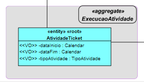

Esta US, como base, envolve principalmente esta entidade, sendo pertinente também mostrar outras entidades mas em vez de aqui colocar um elevado número de figuras passarei a explicar:

- A informação que aparecerá no Dashboard provém de uma lista de tarefas, que seria uma lista de objetos AtividadeTicket (em que o tipo de atividade seja "MANUAL" ou "APROVACAO"), mas neste caso até se trata de uma lista de objetos AtividadeTicketDTO, sendo que este objeto contém apenas a informação que se pretende apresentar no Dashboard.

- De modo a ser apresentada informação tanto relativa ao Ticket associado a esta AtividadeTicket, como relativa ao serviço a que o ticket foi submetido, foram também criados DTOs para estas classes referidas.

# 3. Design

## 3.1. Realização da Funcionalidade

**Sequência de Passos**:

1. O utilizador inicia a aplicação consola denominada "Portal".

2. A aplicação solicita a autenticação do respetivo utilizador.

3. O utilizador introduz a sua informação de login.

4. Após sucesso do login, ocorre o seguinte (em paralelo):

 	- A aplicação consola cria localmente um servidor HTTP, acessível apenas pelo localhost, e abre o URL respetivo onde mostra o dashboard web do utilizador que se autenticou na consola. Este servidor, aceita os refresh da página HTML. A informação disponibilizada é obtida por comunicação entre o servidor HTTP e o Motor de Fluxo (cf. Protocolo de Comunicação).

	- A aplicação consola continua a execução "normal" da sua UI para o utilizador aceder/usar as restantes funcionalidades.

5. O utilizador ao fazer logout ou sair da aplicação consola, o servidor HTTP deve terminar.

## 3.2. Classes Utilizadas

- HttpAjaxVotingRequest

- HTTPmessage

- HTTPServerAjaxVoting

- ShowDashboardController

- ShowDashboardUI

- AtividadeTicket

- AtividadeTicketDTO

- ServicoDTO

- TicketDTO

- ListAtividadeTicketService

## 3.3. Padrões Aplicados

- Controller

- Creator

- Builder

- Repository

- Factory

- Persistence Context

- DTO

# 4. Implementação

#### Informação Utilizada para obter a lista de tarefas pendentes assignadas ao colaborador autenticado:

Dados Servidor:

* Os dados relativos ao **ServerMotorFluxos**, tanto o **IP**, a **Porta**, **Trusted Store** e **Keys Store Pass** a ser utilizada, encontram-se presentes no ficheiro ***application.properties*** (HelpdeskService/helpdesk.app.motorDeFluxos/src/main/resources/application.properties) da aplicação ***helpdesk.app.motorDeFluxos*** (HelpdeskService/helpdesk.app.motorDeFluxos).

     | Server IP  | Server Port | Trusted Store        | Keys Store Pass |
     |:---------- |:----------- |:-------------------- |:--------------- |
     |10.9.21.88  |2021         |serverMotorFluxos.jks |forgotten        |

* Os dados relativos ao **ServerHTTP**, **Trusted Store** e **Keys Store Pass** a ser utilizada, encontram-se presentes no ficheiro ***application.properties*** (HelpdeskService/helpdesk.app.portal.console/src/main/resources/application.properties) da aplicação ***helpdesk.app.portal.console*** (HelpdeskService/helpdesk.app.portal.console).

     | Trusted Store     | Keys Store Pass |
     |:----------------- |:--------------- |
     |serverHTTP.jks     |forgotten        |

---

#### Fluxo de Troca de Mensagens entre o Cliente e o Servidor

Obter a Lista de Tarefas Pendentes Assignadas(chamada em List<AtividadeTicketDTO> metodo() da classe ShowDashboardController):

1. **Manda** ao **Servidor** o **Código de Teste (0)**.
2. **Espera** pela mensagem do **Servidor** com o **Código de Entendido (2)**.
3. **Manda** ao **Servidor** o **Código de Lista de Tarefas Pendentes Assignadas (4)**.
4. **Espera** pela mensagem do **Servidor** com o **Código de Entendido (2)**.
5. **Envia o Colaborador** para o **Servidor**.
6. **Espera** pela lista com as **tarefas pendentes assignadas** do **Servidor**.
7. **Manda** ao **Servidor** o **Código de Fim (1)**.
8. **Espera** pela mensagem do **Servidor** com o **Código de Entendido (2)**.
9. **Fecha** o Socket.

* (**NOTA**: Caso exista algum problema durante a troca de mensagens o **socket é fechado**)

---

* Foi utilizado o **Padrão DTO**.
* Foi utilizado o **Protocolo de Comunicação SDP2021**.
* Ficheiro de Configurações: **application.properties**.
* Todos os **tipos de erros** durante a **troca de mensagens**, que possam surgir, são completamente **verificados**.

---

#### Explicação mais detalhada do desenvolvimento da Dashboard:

Na Dashboard desenvolvida, como já vou explicar no ponto seguinte, temos presentes 3 tabelas de informação relativa a tarefas e mais uma pequena label contendo a informação relativa ao utilizador que se encontra autenticado. Para tal foram desenvolvidos os seguintes métodos:

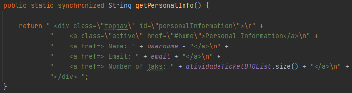

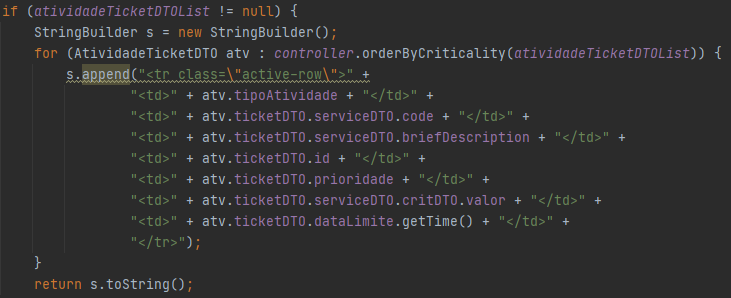
(Elaborei 3 métodos contendo este excerto de código, sendo que cada um chamava a ordenação respetiva)

Estes quatro métodos (primeiro e 3 idênticos referidos), são então chamados na classe HttpAjaxVotingRequest como irei mostrar na figura abaixo (parte do código sublinhada a azul), de modo a que a informação seja recebida em html e, consequentemente apresentada na página Web.

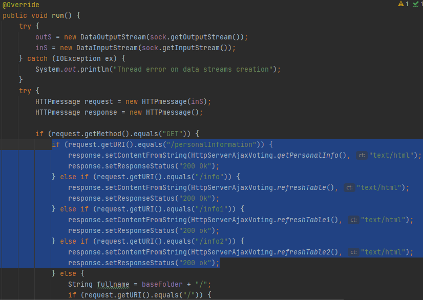

---

Na classe HTTPServerAjaxVoting temos no método run esta parte de código de modo a abrir um Socket com o port 55090:

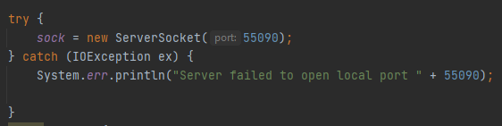

Na classe ShowDashboardUI temos presente o método doShow, que chama o método que obtém a lista de tarefas pretendida e que procede à apresentação da dashboard logo após o utilizador dar login:

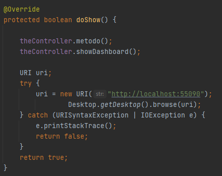

E como podemos ver em "uri = new URI("http://localhost:55090");", a página abrirá em localhost, utilizando o mesmo port já apresentado em cima (55090).

---

Para o desenvolvimento da dashboard foram utilizados os ficheiros que estão estão presente na pasta www (core-Dashboard-domain), além das classes já referidas em 3.2:

- index.html

- rcomp-ajax.js

- style.css

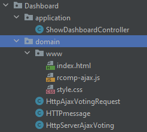

---

De modo a deixar a Dashboard atualizada, procedi à criação dos métodos refreshPersonalInfo(), refreshTable(), refreshTable1(), refreshTable2() no ficheiro rcomp-ajax.js em que as suas chamadas estão presentes no ficheiro index.html na linha 8 ("<body onload="refreshPersonalInfo(); refreshTable(); refreshTable1(); refreshTable2();").

- refreshPersonalInfo()

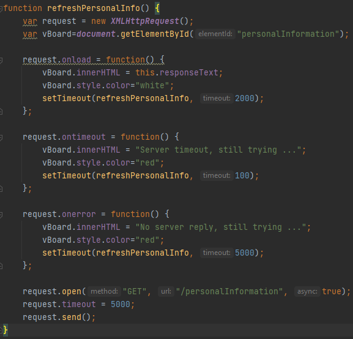

- refreshTable() -> restantes 2 métodos refreshTable1() e refreshTable2() contendo o mesmo raciocínio mas para o refreshTable1(), o elementId é "info1" e o url "/info1" e para o refreshTable2(), o elementId é "info2" e o url "/info2". Podemos ver que o que é aqui referido bate certo com o código desenvolvido no método run apresentado mais em cima, sendo que este contem ifs de modo a verificar se request.getURI().equals("/...").

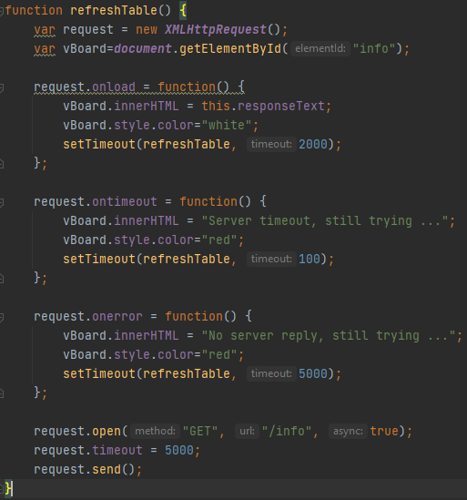

# 5. Integração/Demonstração

## Demonstração da Dashboard desenvolvida:

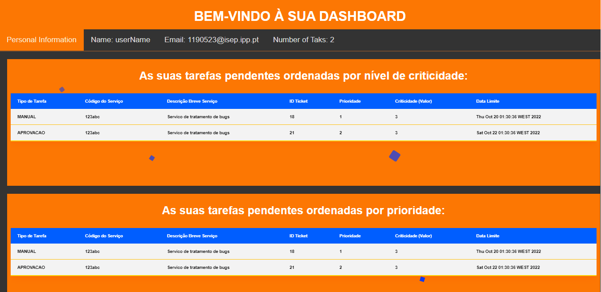

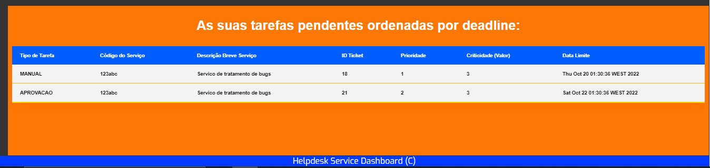

Como podemos ver, coloquei dados pessoais relativos ao colaborador que se encontra autenticado (nome e email), indicando também o número de tarefas pendentes que este tem assignadas a ele. Na página elaborei 3 tabelas, sendo que a primeira apresenta as tarefas ordenadas por criticidade, a segunda por prioridade e a terceira por deadline. Coloquei ainda uma pequena animação na página de modo a torná-la mais intuitiva.

Esta US está relacionada com as seguintes US´s:

- US4002 (Motor de Fluxos de Atividades), sendo que existe comunicação com o motor de fluxos de modo a indicar qual o colaborador que está autenticado, e após isso, este envia as tarefas pendentes assignadas a esse colaborador , utilizando o Protocolo SDP2021.

- US3022, sendo que só irão aparecer na dashboard tarefas pendentes ao utilizador caso sejam assignadas tarefas ao utilizador, sendo que isto se processa na US3022.

- US3021, sendo que a parte do mecanismo de obtenção das tarefas se processa da mesma forma que nesta US.

Para tal, baseei-me no exemplo disponibilizado no GitHub do professor ASC, mais concretamente no package http-server-ajax-voting.

# 6. Observações

- Foram também criados testes de modo a testar os 3 métodos de ordenação utilizados nesta US (orderByPriority(), orderByCriticality() e orderByDeadline()).
