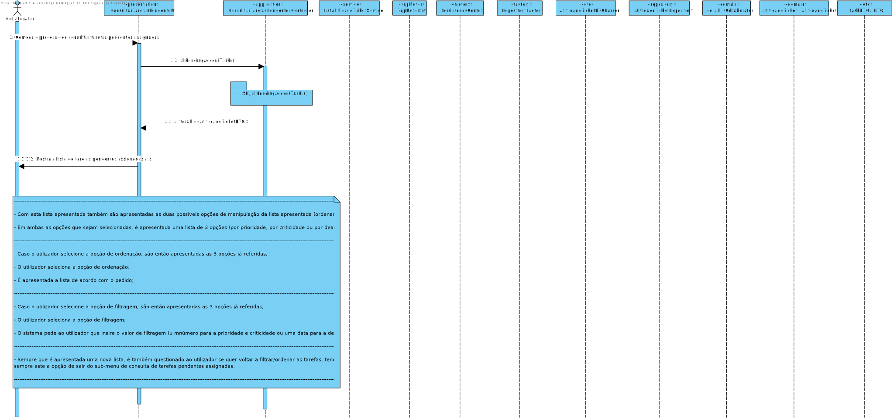

# US 3021 - Consultar as tarefas pendentes assignadas a um utilizador
=======================================

# 1. Requisitos

**US3021**:

- Como utilizador, eu pretendo consultar as tarefas pendentes que me estão assignadas.

- A interpretação feita deste requisito foi no sentido de mostrar ao utilizador que se encontra autenticado todas as tarefas pendentes em que o utilizador em questão está associado. Além disso, este poderá ter opções de escolha em termos de ordenação/filtragem relativamente à lista de tarefas que lhe for apresentada.

# 2. Análise

- Nesta US, pretende-se que o utilizador consulte na consola todas as tarefas pendentes em que o utilizador em questão está associado. Além disso, este pode ordenar e filtrar as tarefas apresentadas por criticidade, prioridade e deadline.

## Excerto do Modelo de Domínio

Esta US, como base, envolve principalmente esta entidade, sendo pertinente também mostrar outras entidades mas em vez de aqui colocar um elevado número de figuras passarei a explicar:

- A informação que aparecerá na consola trata-se de uma lista de tarefas, que seria uma lista de objetos AtividadeTicket (em que o tipo de atividade seja "MANUAL" ou "APROVACAO"), mas neste caso até se trata de uma lista de objetos AtividadeTicketDTO, sendo que este objeto contém apenas a informação que se considera pertinente  apresentar na consola.

- De modo a ser apresentada informação tanto relativa ao Ticket associado a esta AtividadeTicket, como relativa ao serviço a que o ticket foi submetido, foram também criados DTOs para estas classes referidas.

# 3. Design

## 3.1. Realização da Funcionalidade

A US procede-se da seguinte forma:

- É iniciado o processo de consulta das tarefas pendentes assignadas ao colaborador que se encontra autenticado na aplicação Portal;

- É então apresentada tanto uma lista de tarefas pendentes assignadas ao colaborador que se encontra autenticado, como as duas possíveis opções de manipulação da lista apresentada (ordenar/filtrar);

- Em ambas as opções que sejam selecionadas, é apresentada uma lista de 3 opções (por prioridade, por criticidade ou por deadline);

---

- Caso o utilizador selecione a opção de ordenação, são então apresentadas as 3 opções já referidas;

- O utilizador seleciona a opção de ordenação;

- É apresentada a lista de acordo com o pedido;

---

- Caso o utilizador selecione a opção de filtragem, são então apresentadas as 3 opções já referidas;

- O utilizador seleciona a opção de filtragem;

- O sistema pede ao utilizador que insira o valor de filtragem (u mnúmero para a prioridade e criticidade ou uma data para a deadline);

---

- Sempre que é apresentada uma nova lista, é também questionado ao utilizador se quer voltar a filtrar/ordenar as tarefas, tendo sempre este a opção de sair do sub-menu de consulta de tarefas pendentes assignadas.

### SD

.svg)

## 3.2. Classes Utilizadas

- ConsultarTarefasPendentesController

- ConsultarTarefasPendentesUI

- AtividadeTicket

- AtividadeTicketDTO

- ServicoDTO

- TicketDTO

- ListAtividadeTicketService

## 3.3. Padrões Aplicados

- Controller

- Creator

- Builder

- Repository

- Factory

- Persistence Context

- DTO

# 4. Implementação

---

### Dados do Servidor Motor de Fluxos

* Os dados relativos ao **servidor**, tanto o **IP**, a **Porta**, **Trusted Store** e **Keys Store Pass** a ser utilizada, encontram-se presentes no ficheiro ***application.properties*** (HelpdeskService/helpdesk.core/src/main/resources/application.properties) da aplicação ***helpdesk.core*** (HelpdeskService/helpdesk.core).

| Server IP  | Server Port | Trusted Store        | Keys Store Pass |
|:---------- |:----------- |:-------------------- |:--------------- |
|10.9.21.88  |2021         |serverMotorFluxos.jks |forgotten        |

---

#### Fluxo de Troca de Mensagens entre o Cliente e o Servidor

Obter a Lista de Tarefas Pendentes Assignadas (chamada em List<AtividadeTicketDTO> allPendingTasks() da classe ConsultarTarefasPendentesController):

1. **Manda** ao **Servidor** o **Código de Teste (0)**.
2. **Espera** pela mensagem do **Servidor** com o **Código de Entendido (2)**.
3. **Manda** ao **Servidor** o **Código de Lista de Tarefas Pendentes Assignadas (4)**.
4. **Espera** pela mensagem do **Servidor** com o **Código de Entendido (2)**.
5. **Envia o Colaborador** para o **Servidor**.
6. **Espera** pela lista com as **tarefas pendentes assignadas** do **Servidor**.
7. **Manda** ao **Servidor** o **Código de Fim (1)**.
8. **Espera** pela mensagem do **Servidor** com o **Código de Entendido (2)**.
9. **Fecha** o Socket.

* (**NOTA**: Caso exista algum problema durante a troca de mensagens o **socket é fechado**)

---

* Foi utilizado o **Padrão DTO**.
* Foi utilizado o **Protocolo de Comunicação SDP2021**.
* Ficheiro de Configurações: **application.properties**.
* Todos os **tipos de erros** durante a **troca de mensagens**, que possam surgir, são completamente **verificados**.

---

# 5. Integração/Demonstração

Esta US está relacionada com as US´s:

- US4002 (Motor de Fluxos de Atividades), sendo que existe comunicação com o motor de fluxos de modo a indicar qual o colaborador que está autenticado, e após isso, este envia as tarefas pendentes assignadas a esse colaborador, utilizando o Protocolo SDP2021.

- US3022, sendo que só irão aparecer na consola tarefas pendentes ao utilizador caso sejam assignadas tarefas ao utilizador, sendo que isto se processa na US3022.

- US3011, sendo que a parte do mecanismo de obtenção das tarefas se processa da mesma forma que nesta US.

# 6. Observações

- - Foram também criados testes de modo a testar os 3 métodos de ordenação utilizados nesta US (orderByPriority(), orderByCriticality() e orderByDeadline() para ordenações e filterByPriority(), filterByCriticality() e filterByDeadline() para filtragens).
