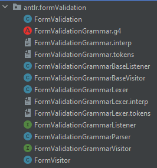
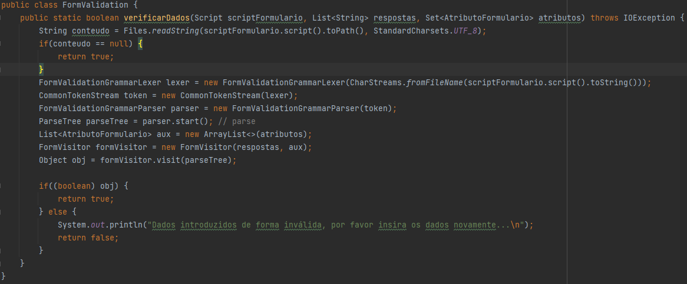

# US3023 - Realizar uma tarefa pendente
==============================================================================

# 1. Requisitos

**US 3023**:

- Como utilizador, eu pretendo realizar uma tarefa que tenho como pendente.

# 2. Análise

A realização de uma tarefa pendente por parte de um colaborador, trata-se do preenchimento de um formulário (de aprovação/resolução) e no caso de se tratar de uma tarefa de aprovação, após esse preenchimento este deve ainda indicar se aprova ou não a tarefa.

### Excerto Relevante do Modelo de Domínio

Esta US, como base, envolve principalmente esta entidade, sendo pertinente também mostrar outras entidades mas em vez de aqui colocar um elevado número de figuras passarei a explicar:

- Serão apresentadas as tarefas pendentes assignadas ao colaborador que se encontra autenticado, podendo este selecionar uma de modo a realizá-la.

- Após o preenchimento do formulário, caso se trate de uma tarefa de aprovação, será ainda questionado se aprova a tarefa ou não.

- Para guardar toda a informação, acontecerá o seguinte, será armazenada a data de início e de fim de realização da tarefa (value objects da entidade AtividadeTicket), o estado do Ticket associado à AtividadeTicket em questão atualizado. Além disso, será feito o cálculo do tempo decorrido na realização da tarefa em minutos, de modo a ser armazenado este tempo na tabela de SLAs (entidade SLA).

# 3. Design

## 3.1. Realização da Funcionalidade

A US procede-se da seguinte forma:

- É iniciado o processo de Realização de Tarefa Pendente

- São apresentadas ao colaborador que se encontra autenticado as suas tarefas pendentes, solicitando a seleção de uma delas

- O utilizador seleciona a tarefa que pretende realizar

- De seguida são apresentados os dados do ticket associado a essa tarefa, bem como os atributos a preencher presentes no formulário associado à tarefa em questão

- O utilizador procede ao preenchimento dos atributos solicitados

- Caso a tarefa seja de aprovação, após esse preenchimento, será questionado ao utilizador se este aprova a tarefa ou não e, caso este não aprove, o estado do ticket passará a "REJEITADO", caso contrário este passará a "APROVADO", sendo armazenados todos os dados já referidos no ponto 2 (Análise).

- Caso a tarefa seja de execução, após esse preenchimento, serão armazenados todos os dados já referidos no ponto 2 (Análise), ficando o estado do ticket a "RESOLVIDO".

## 3.2. Classe Utilizadas

- AtividadeTicket

- AtividadeTicketDTO

- Ticket

- TicketDTO

- Formulario

- FormularioPreenchido

- AtributoFormulario

- AtributoPreenchido

- Collaborator

- Classes presentes em helpdesk.core.src.main.java.eapli.helpdesk.antlr.formValidation

## 3.3. Padrões Aplicados

- Controller

- Creator

- Repository

- Factory

- Persistence Context

- Transactional Context

- DTO

# 4. Implementação

- Foi implementado o conceito de transação, uma vez que esta envolvia vários armazenamentos em bases de dados de uma vez, sendo que apenas faz sentido ficar tudo armazenado e não apenas certos dados (caso ocorra algum problema aquando da execução da aplicação).

- Para além da validação dos campos inseridos através das expressões regulares dos atributos do formulário, os dados introduzidos foram também validados através da gramática relativa ao formulário desenvolvida por mim na US 1004, ou seja, através do uso das classes relativas à gramática (foram utilizados Visitors):

- Sendo este o método desenvolvido faz uso dessas classes:

---

### Dados do Servidor Motor de Fluxos

* Os dados relativos ao **servidor**, tanto o **IP**, a **Porta**, **Trusted Store** e **Keys Store Pass** a ser utilizada, encontram-se presentes no ficheiro ***application.properties*** (HelpdeskService/helpdesk.app.portal.console/src/main/resources/application.properties) da aplicação ***helpdesk.app.portal.console*** (HelpdeskService/helpdesk.app.portal.console).

| Server IP  | Server Port | Trusted Store        | Keys Store Pass |
|:---------- |:----------- |:-------------------- |:--------------- |
|10.9.21.88  |2021         |serverMotorFluxos.jks |forgotten        |

---

#### Fluxo de Troca de Mensagens entre o Cliente e o Servidor

Obter a Lista de Tarefas que o Colaborador que se encontra autenticado pode realizar (chamada em RealizarTarefaPendenteController, método List<AtividadeTicketDTO> showTasksPossibleToBeDone()):

1. **Manda** ao **Servidor** o **Código de Teste (0)**.
2. **Espera** pela mensagem do **Servidor** com o **Código de Entendido (2)**.
3. **Manda** ao **Servidor** o **Código de Lista de Tarefas que o Colaborador que se encontra autenticado pode realizar (10)**.
4. **Espera** pela mensagem do **Servidor** com o **Código de Entendido (2)**.
5. **Envia o Colaborador** para o **Servidor**.
6. **Espera** pela lista com as **Tarefas Pendentes a realizar** do **Servidor**.
7. **Manda** ao **Servidor** o **Código de Fim (1)**.
8. **Espera** pela mensagem do **Servidor** com o **Código de Entendido (2)**.
9. **Fecha** o Socket.

* (**NOTA**: Caso exista algum problema durante a troca de mensagens o **socket é fechado**)

Enviar Dados a armazenar, ou seja, formulário preenchido, datas de início e fim de realização da tarefa, no caso de ser uma tarefa de aprovação e que seja aprovada:

* Chamada no método saveTaskInfo(13, formularioPreenchido, c, c1, selected) (para este caso o código é o 13) - RealizarTarefaPendenteController

Enviar Dados a armazenar, ou seja, formulário preenchido, datas de início e fim de realização da tarefa, no caso de ser uma tarefa de aprovação e que seja rejeitada:

* Chamada no método saveTicketInfo(14, selected.ticket()) (para este caso o código é o 14) - RealizarTarefaPendenteController

Enviar Dados a armazenar, ou seja, formulário preenchido, datas de início e fim de realização da tarefa, no caso de ser uma tarefa de resolução:

* Chamada no método saveTaskInfo(15, formularioPreenchido, c, c1, selected) (para este caso o código é o 15) - RealizarTarefaPendenteController

(**NOTA**: Caso exista algum problema durante a troca de mensagens o **socket é fechado**)

---

* Foi utilizado o **Padrão DTO**.
* Foi utilizado o **Protocolo de Comunicação SDP2021**.
* Ficheiro de Configurações: **application.properties**.
* Todos os **tipos de erros** durante a **troca de mensagens**, que possam surgir, são completamente **verificados**.

---

# 5. Integração/Demonstração

- Esta US encontra-se relacionada com a US 4002, sendo que existe comunicação com o motor de fluxos, de modo a ser tanto obtida como enviada informação.

- Esta US encontra-se relacionada com a US 1004/1007, sendo que além de os atributos inseridos serem validados através das expressões regulares, é feita uma validação final de modo a confirmar o que se encontra especificado no script do formulário, por meio de Visitors.

# 6. Observações

- -
