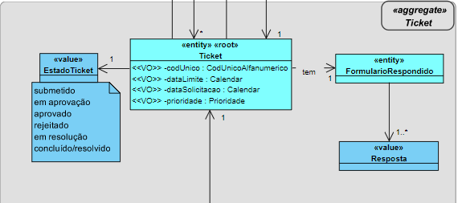
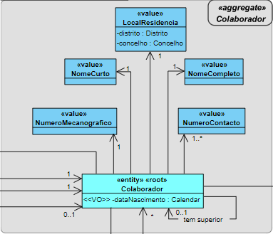
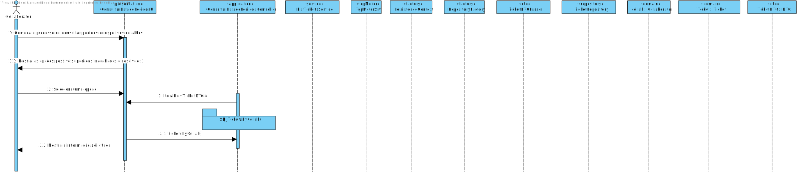
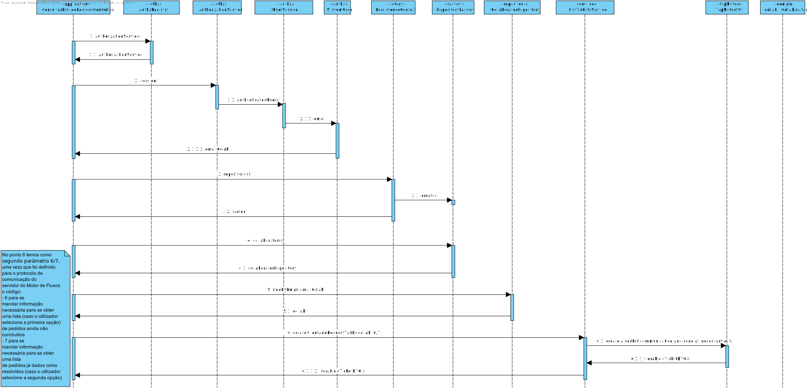

# US3031 - Consultar pedidos (em curso ou o histórico) e respetivos detalhes/estado.
==============================================================================

# 1. Requisitos

**US3031**:

- Como utilizador, eu pretendo consultar os meus pedidos (em curso ou o histórico) e respetivos detalhes/estado.

- Estes pedidos devem estar separados entre (i) em curso e (ii) histório.

- Devem ainda estar ordenados dos mais recentes para os mais antigos.

# 2. Análise

- Nesta US, pretende-se que o utilizador consulte na consola todos os seus pedidos, sendo que estes irão estar separados entre pedidos em curso (ainda não finalizados) e histórico (pedidos já dados como finalizados/resolvidos),

### Excerto Relevante do Modelo de Domínio

Entidade Ticket (Pedido):

Este pedido é submetido por um Colaborador:

# 3. Design

## 3.1. Realização da Funcionalidade

A US procede-se da seguinte forma:

- É iniciado o processo de consulta dos pedidos (em curso ou o histórico) e respetivos detalhes/estado (por parte do utilizador autenticado).

- São então apresentadas 2 opções ao utilizador, ou seja, se pretende visualizar os pedidos em curso e respetivos detalhes ou se pretende visualizar os pedidos já resolvidos e respetivos detalhes.

- Em ambas as opções que sejam selecionadas, os dados são apresentados por ordem de data de solicitação do pedido;

### SD

## 3.2. Classes Utilizadas

- ConsultarEstadoPedidosController

- ConsultarEstadoPedidosUI

- Ticket

- TicketDTO

- ServicoDTO

- ListTicketsService

## 3.3. Padrões Aplicados

- Controller

- Creator

- Repository

- Factory

- Persistence Context

- DTO

# 4. Implementação

---

### Dados do Servidor Motor de Fluxos

* Os dados relativos ao **servidor**, tanto o **IP**, a **Porta**, **Trusted Store** e **Keys Store Pass** a ser utilizada, encontram-se presentes no ficheiro ***application.properties*** (HelpdeskService/helpdesk.app.portal.console/src/main/resources/application.properties) da aplicação ***helpdesk.app.portal.console*** (HelpdeskService/helpdesk.app.portal.console).

| Server IP  | Server Port | Trusted Store        | Keys Store Pass |
|:---------- |:----------- |:-------------------- |:--------------- |
|10.9.21.88  |2021         |serverMotorFluxos.jks |forgotten        |

---

#### Fluxo de Troca de Mensagens entre o Cliente e o Servidor

Obter a Lista de Tickets ainda não finalizados:

1. **Manda** ao **Servidor** o **Código de Teste (0)**.
2. **Espera** pela mensagem do **Servidor** com o **Código de Entendido (2)**.
3. **Manda** ao **Servidor** o **Código de Lista de Tickets ainda não finalizados (6)**.
4. **Espera** pela mensagem do **Servidor** com o **Código de Entendido (2)**.
5. **Envia o Colaborador** para o **Servidor**.
6. **Espera** pela lista com os **Tickets ainda não finalizados** do **Servidor**.
7. **Manda** ao **Servidor** o **Código de Fim (1)**.
8. **Espera** pela mensagem do **Servidor** com o **Código de Entendido (2)**.
9. **Fecha** o Socket.

* (**NOTA**: Caso exista algum problema durante a troca de mensagens o **socket é fechado**)

Obter a Lista de Tickets já dados como resolvidos:

1. **Manda** ao **Servidor** o **Código de Teste (0)**.
2. **Espera** pela mensagem do **Servidor** com o **Código de Entendido (2)**.
3. **Manda** ao **Servidor** o **Código de Lista de Tickets já dados como resolvidos (7)**.
4. **Espera** pela mensagem do **Servidor** com o **Código de Entendido (2)**.
5. **Envia o Colaborador** para o **Servidor**.
6. **Espera** pela lista com os **Tickets já dados como resolvidos** do **Servidor**.
7. **Manda** ao **Servidor** o **Código de Fim (1)**.
8. **Espera** pela mensagem do **Servidor** com o **Código de Entendido (2)**.
9. **Fecha** o Socket.

* (**NOTA**: Caso exista algum problema durante a troca de mensagens o **socket é fechado**)

---

* Foi utilizado o **Padrão DTO**.
* Foi utilizado o **Protocolo de Comunicação SDP2021**.
* Ficheiro de Configurações: **application.properties**.
* Todos os **tipos de erros** durante a **troca de mensagens**, que possam surgir, são completamente **verificados**.

---

# 5. Integração/Demonstração

Esta US está relacionada com as US´s:

- US4002 (Motor de Fluxos de Atividades), sendo que existe comunicação com o motor de fluxos de modo a indicar qual o colaborador que está autenticado, e após isso, este envia os pedidos que foram solicitados por esse colaborador, utilizando o Protocolo SDP2021.

- US3003, sendo que só irão aparecer na consola pedidos efetuados pelo utilizador caso sejam solicitados serviços anteriormente.

# 6. Observações

- -
