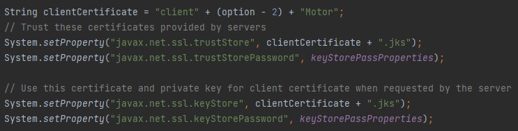

# US3101 - Garantir que as comunicações realizadas como aplicação cliente através do protocolo SDP2021 estejam protegidas (Portal)
=====================================================================

# 1. Requisitos

**US 3101:**

* Como **Gestor de Projeto**, eu pretendo que as **comunicações** realizadas como aplicação servidora através do protocolo SDP2021 estejam **protegidas**.

# 2. Dados do Servidores

* Os dados relativos ao **ServerMotorFluxos**, tanto o **IP**, a **Porta**, **Trusted Store** e **Keys Store Pass** a ser utilizada, encontram-se presentes no ficheiro ***application.properties*** (HelpdeskService/helpdesk.app.motorDeFluxos/src/main/resources/application.properties) da aplicação ***helpdesk.app.motorDeFluxos*** (HelpdeskService/helpdesk.app.motorDeFluxos).

     | Server IP  | Server Port | Trusted Store        | Keys Store Pass |
     |:---------- |:----------- |:-------------------- |:--------------- |
     |10.9.21.88  |2021         |serverMotorFluxos.jks |forgotten        |

* Os dados relativos ao **ServerHTTP**, **Trusted Store** e **Keys Store Pass** a ser utilizada, encontram-se presentes no ficheiro ***application.properties*** (HelpdeskService/helpdesk.app.portal.console/src/main/resources/application.properties) da aplicação ***helpdesk.app.portal.console*** (HelpdeskService/helpdesk.app.portal.console).

     | Trusted Store     | Keys Store Pass |
     |:----------------- |:--------------- |
     |serverHTTP.jks     |forgotten        |

# 3. Certificados

* Todos os **certificados**, tanto do **servidor** como do **cliente**, para a comunicação com o **ServerHTTP** são gerados a partir do script do ficheiro ***make_cert_http.sh*** (HelpdeskService/make_cert_http.sh).

## 3.1. Certificados Utilizados

---

* Para o servidor: ***serverHTTP.jks*** (HelpdeskService/serverExecutor.jks)
* Para o cliente: ***cliente2Motor.jks*** (HelpdeskService/cliente2Motor.jks) - cliente 2 uma vez que nos nossos métodos createClienteAnd..., fazemos option - 2, e a opção para obter os dados a apresentar na dashboard (US 3011) é a 4.

---

* Para o servidor: ***serverMotorFluxos.jks*** (HelpdeskService/serverMotorFluxos.jks)
* Para o cliente: ***cliente2Motor.jks*** (HelpdeskService/cliente2Motor.jks) - cliente 2 uma vez que nos nossos métodos createClienteAnd..., fazemos option - 2, e a opção para obter os dados a apresentar na consola (US 3021) é a 4.

---

* Para o servidor: ***serverMotorFluxos.jks*** (HelpdeskService/serverMotorFluxos.jks)
* Para o cliente: ***cliente4Motor.jks*** (HelpdeskService/cliente4Motor.jks) - cliente 4 uma vez que nos nossos métodos createClienteAnd..., fazemos option - 2, e a opção para obter os dados a apresentar na consola (US 3031) é a 6.

---

* Para o servidor: ***serverMotorFluxos.jks*** (HelpdeskService/serverMotorFluxos.jks)
* Para o cliente: ***cliente5Motor.jks*** (HelpdeskService/cliente5Motor.jks) - cliente 5 uma vez que nos nossos métodos createClienteAnd..., fazemos option - 2, e a opção para obter os dados a apresentar na consola (US 3031) é a 7.

---

* Para o servidor: ***serverMotorFluxos.jks*** (HelpdeskService/serverMotorFluxos.jks)
* Para o cliente: ***cliente8Motor.jks*** (HelpdeskService/cliente8Motor.jks) - cliente 8 uma vez que nos nossos métodos createClienteAnd..., fazemos option - 2, e a opção para obter os dados a apresentar na consola (US 3023) é a 10.

---

* Para o servidor: ***serverMotorFluxos.jks*** (HelpdeskService/serverMotorFluxos.jks)
* Para o cliente: ***cliente11Motor.jks*** (HelpdeskService/cliente8Motor.jks) - cliente 11 uma vez que nos nossos métodos createClienteAnd..., fazemos option - 2, e a opção para obter os dados a apresentar na consola (US 3023) é a 13.

---

* Para o servidor: ***serverMotorFluxos.jks*** (HelpdeskService/serverMotorFluxos.jks)
* Para o cliente: ***cliente12Motor.jks*** (HelpdeskService/cliente8Motor.jks) - cliente 14 uma vez que nos nossos métodos createClienteAnd..., fazemos option - 2, e a opção para obter os dados a apresentar na consola (US 3023) é a 14.

---

* Como é visível nesta print, temos então o nome a ser dado ao clientCertificate com base no raciocínio option - 2 já referido. Esta password "keyStorePassProperties", tal como já foi aqui referido tem como valor "forgotten".

---

# 4. Implementação

* Foi utilizado o **Protocolo de Comunicação SDP2021**.
* Ficheiro de Configurações: **application.properties**.
* Foram utilizados **certificados** para que exista uma **comunicação segura** entre o servidor e o cliente.

# 5. Integração/Demonstração

* Esta **US** está relacionada com a **US4002 (Motor de Fluxos de Atividades)**, ou seja, o motor de fluxos agora irá enviar a informação tal como no Sprint passado, utilizando o **Protocolo SDP2021**, mas desta vez através de uma **comunicação segura**, através dos **certificados**, para o **servidor**.

* Esta **US** está relacionada com as **US3011**, **US3021**, **US3023** e **US3031**, ou seja, o motor de fluxos agora irá enviar a informação necessária em cada uma dessas US´s, utilizando o **Protocolo SDP2021**, mas desta vez através de uma **comunicação segura**, através dos **certificados**.

# 6. Observações

* -
