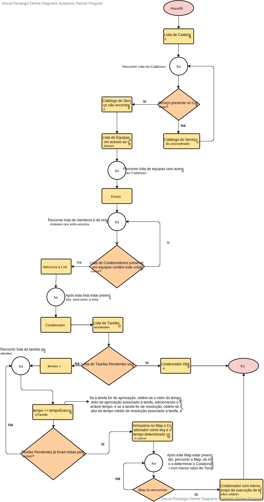
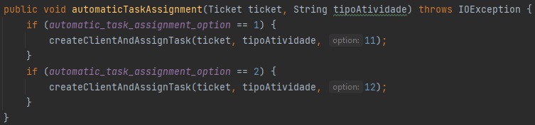

# US 4072 - Algoritmos de Atribuição de Tarefas a Colaboradores de forma Automática
=======================================================================================================

# 1. Requisitos

**US4072:**

* Como **Gestor de Projeto**, eu pretendo que seja desenvolvido e integrado no Motor de Fluxos de Atividades algoritmos que assignem automáticamente tarefas a colaboradores de forma a evitar que essas tarefas tenham que ser reivindicadas pelos mesmos.

* Algoritmo a desenvolver - No âmbito de cada equipa, deve ser considerado a quantidade de tarefas pendentes dos colaboradores e o tempo médio de execução de cada uma das tarefas (pré-definido em cada tarefa).

# 2. Dados dos Servidor

## 2.1. Servidor do Motor de Fluxos

| Server IP  | Server Port | Trusted Store        | Keys Store Pass |
|:---------- |:----------- |:-------------------- |:--------------- |
|10.9.21.88  |2021         |serverMotorFluxos.jks |forgotten        |

# 3. Fluxograma

# 4. Implementação

* Raciocínio tido em conta para a implementação deste algoritmo - Estimar a carga de trabalho de cada colaborador que possa satisfazer a tarefa em mãos e atribuir a tarefa aquele que estará em condições de a realizar mais cedo. Exemplo: o colaborador C1 tem 2 tarefas pendentes cujo tempo médio previsto de realização é de 10 minutos e 15 minutos respetivamente, perfazendo um total de 25 minutos enquanto o colaborador C2 tem apenas 1 tarefa pendente mas cujo tempo médio previsto de realização é 35 minutos. Perante este cenário a atribuição de uma nova tarefa realizável por C1 e C2 deverá recair em C1 visto que apesar de ter mais tarefas pendentes conseguirá previsivelmente conclui-las mais cedo do que C2 concluirá a sua tarefa.

Tal como explicado no Fluxograma o raciocínio é o seguinte:

- Obter catálogo
- Obter equipas com acesso ao catálogo obtido
- Criar uma lista com todos os colaboradores presentes nessas equipas (sem repetição de colaboradores)
- Se for encontrado um colaborador sem tarefas pendentes assignadas de momento, é-lhe atribuída a tarefa
- Se todos tiverem tarefas pendentes assignadas, serão percorridos todos os colaboradores de modo a determinar o tempo médio que estes demorarão a finalizar as tarefas que têm como pendentes, sendo os tempos de cada um armazenados
- Por fim é determinado o colaborador com menor tempo calculado, ou seja, aquele que terminará as tarefas mais cedo

* O código encontra-se na Classe **AlgoritmosAtribuicaoTarefas** (HelpdeskService/helpdesk.core/src/main/java/eapli/helpdesk/algoritmosAtribuicao/AlgoritmosAtribuicaoTarefas.java).

* Ficheiro de Configurações: **application.properties** (HelpdeskService/helpdesk.core/src/main/java/resources/application.properties), sendo lá definido qual o algoritmo que irá ser utilizado numa possível atribuição (1 ou 2).

* Para ser feita a atribuição é criado um cliente através do método createClientAndAssignTask (classe AlgoritmosAtribuicaoTarefas), de modo a que o servidor do Motor de Fluxos trate do processamento da informação na BD, sendo que para o caso do segundo algoritmo, a opção é a 12, tal como representado:

# 4. Teste de Velocidade

* O **código** de Teste de Velocidade encontra-se na Classe **TcpCliMotorTesteVelocidadeAtribuicaoTarefa** (HelpdeskService/helpdesk.app.motorDeFluxos/src/main/java/eapli/helpdesk/app/MotorDeFluxos/TcpMotor/TcpCliMotorTesteVelocidadeAtribuicaoTarefa.java)

* Em **média** demora cerca de **4 segundos** a atribuir a tarefa a um colaborador com base nos requisitos estipulados no algoritmo 2 da US.

* **Exemplo de Output** do Teste de Velocidade: ***"[INFO] O Algoritmo 1de Atribuição de Tarefas 1 demorou 4 segundos a atribuir a tarefa"***

# 5. Integração/Demonstração

* Esta **US** está relacionada com a US de solicitação do serviço, uma vez que é no fim de cada solicitação de um serviço que as tarefas irão ser automaticamente assignadas aos colaboradores.

# 6. Observações

* Estudo para os 2 algoritmos encontra-se efetuado, tal como já referido;

* Além do desenvolvimento deste algoritmo ajudei o meu colega Bruno na elaboração do primeiro algoritmo.
