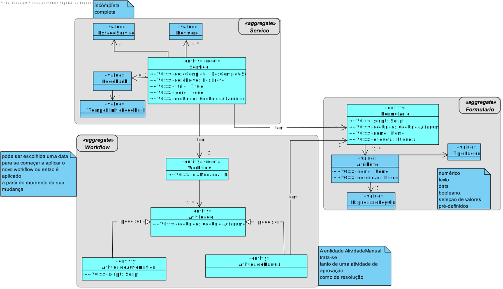

# US1005 - Representação de uma Tarefa Manual
==========================================================================

# 1. Requisitos

**US1005:**

* Como **Gestor de Projeto**, eu pretendo que seja desenvolvida a componente representativa de uma **tarefa manual** dedicada à **apresentação e recolha de informação a/de um utilizador no âmbito de um pedido** e que a mesma seja **adicionada à biblioteca de atividades** típicas do sistema para, dessa forma, poder ser usada na **definição de fluxos de atividades**.

# 2. Análise

## Excerto do Modelo de Domínio

# 3. Implementação

1. Esta **USDemo** não deve ser vista como caso de uso onde há um ator e uma UI para realizar a mesma. Pelo contrário, note-se que quem aparece associado às US é o **"Gestor de Projeto"** que **não é ator** em nenhuma das aplicações em desenvolvimento.

2. Assim, a **USDemo** corresponde a itens de trabalho de **caracter mais técnico** que visam permitir ao sistema como um todo (e não apenas à aplicação X ou Y) **reconhecer e lidar** com diferentes **tipos de atividades**. De momento, o sistema apenas precisa de reconhecer **dois tipos de atividades** (i) **manual** e (ii) **automática**.

# 4. Integração/Demonstração

* Com esta **US** vai ser possível guardar as **Tarefas Manuais** especificadas aquando a especificação de um **serviço**, implementada na **US2003**.

# 5. Observações

* -
