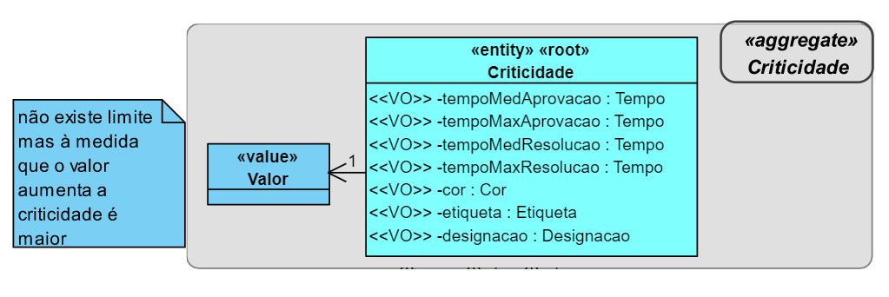
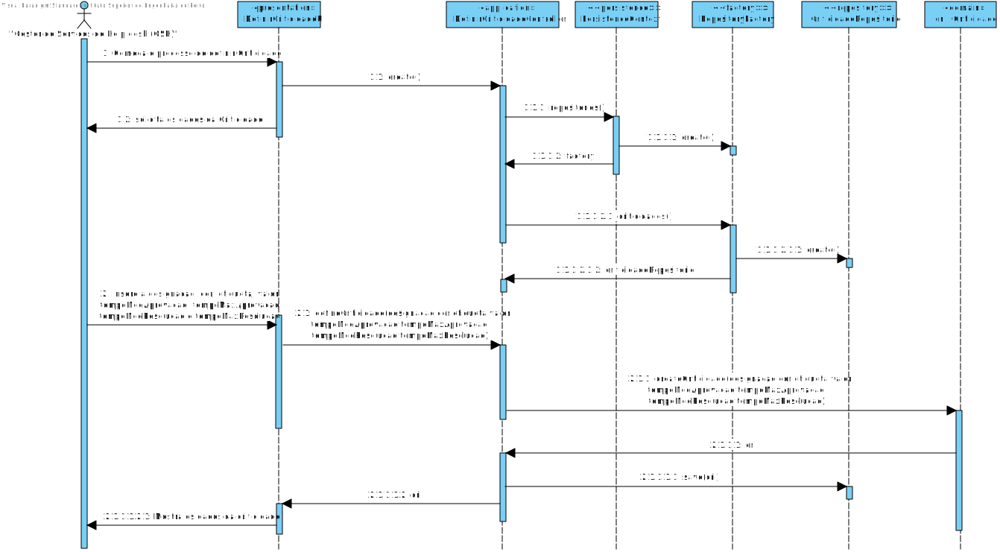

# US2010 - Definir Níveis de Criticidade e Respetivos Objetivos para definição de SLAs
=================================================================

# 1. Requisitos

**US2010:**

* Como **Gestor de Serviços de Helpdesk (GSH)** pretendo **definir** os **níveis de criticidade** e respetivos **objetivos aplicados na organização** para definição de **SLAs**.

* A interpretação feita deste requisito foi no sentido de um **contrato de SLA** assentar essencialmente na **definição de um conjunto de níveis de criticidade** e dos respetivos **objetivos**.

# 2. Análise

## Estudo

* Para definir os **Níveis de Criticidade** é preciso **inserir** uma **designação própria** que varia de organização para organização,  
uma **etiqueta** (e.g. baixa, média, elevada), um **valor** numa escala numérica de inteiros, uma **cor** indicativa de gravidade
e respetivos **objetivos**, i.e., os **tempos máximos e médios a serem satisfeitos tanto na aprovação como na resolução** de uma
solicitação com este nível de criticidade. O **Nível de Criticidade** irá ser uma ***Entity***, porque ele existe por si só ou seja não
depende de algo, e fará parte do seu próprio agregado, ***«Aggregate» Criticidade***. Já, os **dados** que o caracterizam serão representados como ***Value Objects***.

## Excerto do Modelo de Domínio

# 3. Design

## 3.1. Realização da Funcionalidade

## 3.2. Diagrama de Classes

(não é necessário)

## 3.3. Padrões Aplicados

- Controller

- Creator

- Repository

- Factory

- Persistence Context

## 3.4. Testes

**Teste 1:** Salvar Criticidades na Base de dados

private void definirCriticidades() throws TempoException, ValorException, DescricaoException, CorException {

		 //save
		 repo.save(new Criticidade(new Valor(100), new Descricao("Alta"), new Cor("#FFFFFF"), "Alta", new Tempo(10), new Tempo(10), new Tempo(10), new Tempo(10)));
		 repo.save(new Criticidade(new Valor(99), new Descricao("Baixa"), new Cor("#FFFFFF"), "Baixa", new Tempo(10), new Tempo(10), new Tempo(10), new Tempo(10)));
		 LOGGER.info("»»» definidas criticidades");

		 //findAll
		 final Iterable<Criticidade> l = repo.findAll();
		 Invariants.nonNull(l);
		 Invariants.nonNull(l.iterator());
		 Invariants.ensure(l.iterator().hasNext());
		 LOGGER.info("»»» find all criticidades");

		 // count
		 final long n = repo.count();
		 LOGGER.info("»»» # criticidades = {}", n);

		 // ofIdentity
		 final Criticidade c1 = repo.ofIdentity(new Valor(100)).orElseThrow(IllegalStateException::new);
		 final Criticidade c2 = repo.ofIdentity(new Valor(99)).orElseThrow(IllegalStateException::new);
		 LOGGER.info("»»» found criticidades of identity");

		 // containsOfIdentity
		 final boolean hasId = repo.containsOfIdentity(c1.identity());
		 Invariants.ensure(hasId);
		 LOGGER.info("»»» contains criticidade of identity");

		 // contains
		 final boolean has = repo.contains(c1);
		 Invariants.ensure(has);
		 LOGGER.info("»»» contains criticidade");

		 // delete
		 repo.delete(c1);
		 LOGGER.info("»»» delete criticidade");

		 // deleteOfIdentity
		 repo.deleteOfIdentity(c2.identity());
		 LOGGER.info("»»» delete criticidade of identity");

		 // size
		 final long n2 = repo.size();
		 Invariants.ensure(n2 == n - 2);
		 LOGGER.info("»»» # criticidades = {}", n2);
 }

 **Teste 2:** Verificar que não é possível criar uma instância da classe Criticidade com valores nulos.

 	@Test(expected = IllegalArgumentException.class)
 		public void ensureNullIsNotAllowed() {
 		Criticidade instance = new Criticidade(null, null, null, null, null, null, null, null);
 	}

# 4. Implementação

 - Para os **Value Objects** que estão submetidos a regras de negócio, foram criadas classes específicas para eles, de modo a estas **regras serem validadas**.

# 5. Integração/Demonstração

* Esta **US** vai proporionar a **definição de niveis de criticidade** que posteriormente vão ser **associados a catálogos e serviços** e também usados na **tabela de SLA**.

# 6. Observações

* -
