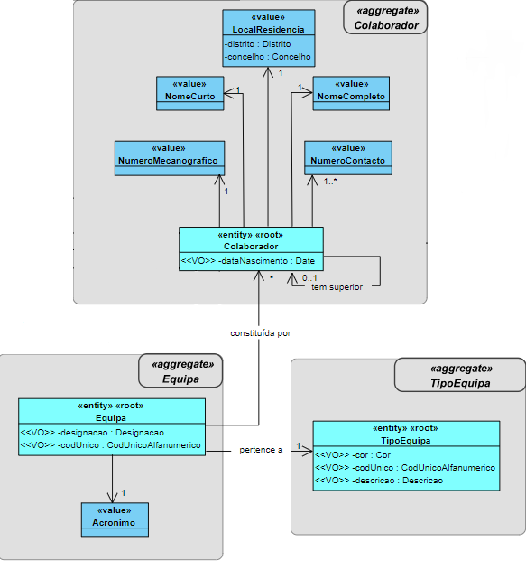
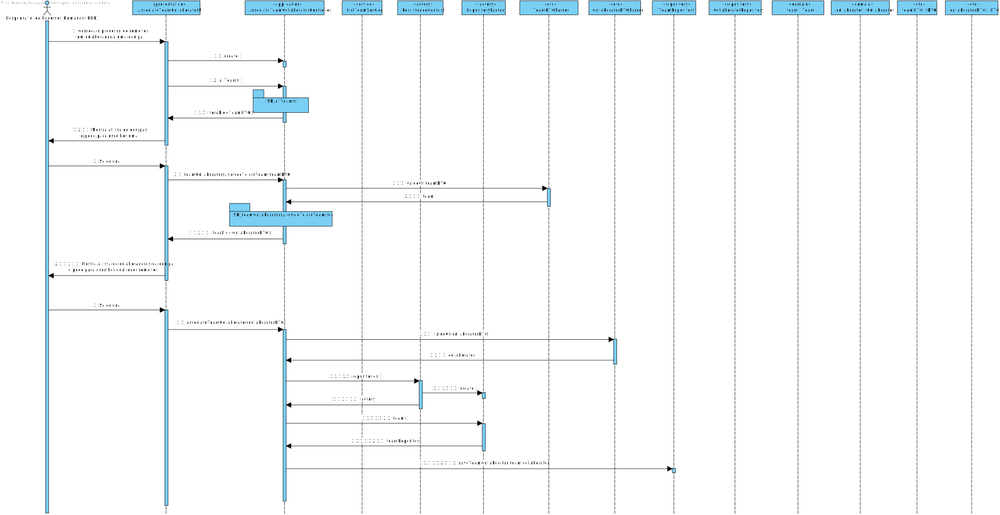

# US2053a - Associar Colaborador a Equipa
================================================================

# 1. Requisitos

**US2053a:**

* Como **Responsável de Recursos Humanos (RRH)** pretendo **associar** um **colaborador**, existente no sistema, a uma **equipa**, existente no sistema.

* A interpretação feita deste requisito foi no sentido de as **equipas corresponderem a um conjunto de vários colaboradores**, que num dado contexto pretende-se que
sejam vistos/considerados/mencionados como um **grupo**.

# 2. Análise

## Excerto do Modelo de Domínio

# 3. Design

## 3.1. Realização da Funcionalidade

## 3.2. Diagrama de Classes

(não é necessário)

## 3.3. Padrões Aplicados

- Controller

- Creator

- Repository

- Factory

- Persistence Context

- DTO

# 4. Implementação

- Foi utilizado o **Padrão DTO**.
- Para os **Value Objects** que estão submetidos a regras de negócio, foram criadas classes específicas para eles, de modo a estas **regras serem validadas**.

# 5. Integração/Demonstração

* Esta **US** vai proporionar o **Team Management**, ou seja, **adicionar** colaboradores as equipas, que foram anteriormente adicionados.

# 6. Observações

* -
