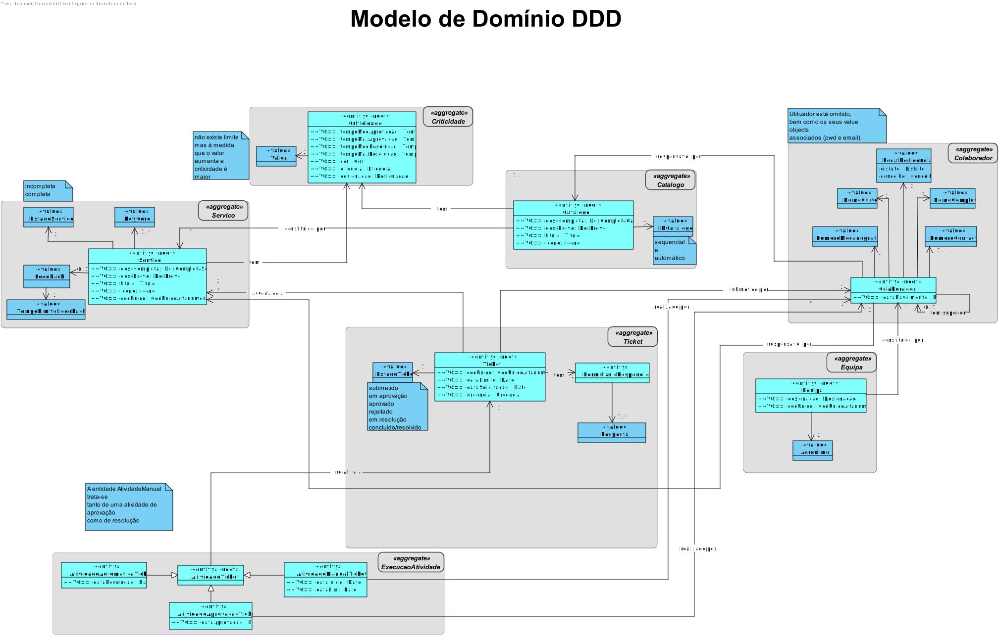
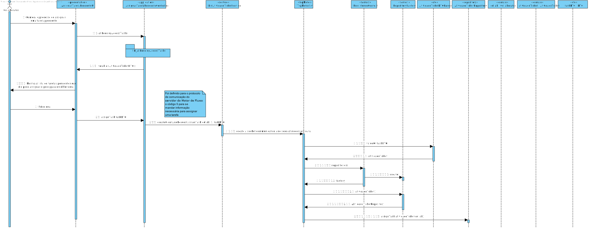

# US3022 - Consultar as Tarefas pendentes que posso reivindicar
========================================================================

# 1. Requisitos

**US3022:**

* Como **Utilizador**, eu pretendo **consultar as tarefas pendentes** que eu posso **reivindicar** para mim e, caso o deseje, concretize essa **reivindicação**.

* A interpretação feita deste requisito foi no sentido de um colaborador poder **realizar tarefas** dos serviços em que uma das suas **equipas é responsável**.

# 2. Análise

## Excerto do Modelo de Domínio

# 3. Design

## 3.1. Realização da Funcionalidade

* SD_US3022

* SD_allPendingAccessTasks()

.svg)

## 3.2. Diagrama de Classes

(não é necessário)

## 3.3. Padrões Aplicados

- Controller

- Creator

- Repository

- Factory

- Persistence Context

- DTO

# 4. Dados do Servidor Motor de Fluxos

* Os dados relativos ao **servidor**, tanto o **IP** como a **Porta** a ser utilizada, encontram-se presentes no ficheiro ***application.properties*** (HelpdeskService/helpdesk.core/src/main/resources/application.properties) da aplicação ***helpdesk.core*** (HelpdeskService/helpdesk.core).

  | Server IP | Server Port |
  |:--------- |:----------- |
  |10.9.21.88 |2021         |

# 5. Fluxo de Troca de Mensagens entre o Cliente e o Servidor

## 5.1. Buscar a Lista de Tarefas Pendentes que pode assignar

1. **Manda** ao **Servidor** o **Código de Teste (0)**.
2. **Espera** pela mensagem do **Servidor** com o **Código de Entendido (2)**.
3. **Manda** ao **Servidor** o **Código de Lista de Tarefas Pendentes (3)**.
4. **Espera** pela mensagem do **Servidor** com o **Código de Entendido (2)**.
5. **Envia o Colaborador** para o **Servidor**.
6. **Espera** pela lista com as **tarefas pendentes** que o colaborador pode assignar do **Servidor**.
7. **Manda** ao **Servidor** o **Código de Fim (1)**.
8. **Espera** pela mensagem do **Servidor** com o **Código de Entendido (2)**.
9. **Fecha** o Socket.

* (**NOTA**: Caso exista algum problema durante a troca de mensagens o **socket é fechado**)

## 5.2. Assignar uma Tarefa ao Colaborador

1. **Manda** ao **Servidor** o **Código de Teste (0)**.
2. **Espera** pela mensagem do **Servidor** com o **Código de Entendido (2)**.
3. **Manda** ao **Servidor** o **Código de Assignar Tarefa (5)**.
4. **Espera** pela mensagem do **Servidor** com o **Código de Entendido (2)**.
5. **Envia o Colaborador** para o **Servidor**.
6. **Envia o Atividade Ticket** para o **Servidor**.
7. **Manda** ao **Servidor** o **Código de Fim (1)**.
8. **Espera** pela mensagem do **Servidor** com o **Código de Entendido (2)**.
9. **Fecha** o Socket.

* (**NOTA**: Caso exista algum problema durante a troca de mensagens o **socket é fechado**)

# 6. Implementação

* Foi utilizado o **Padrão DTO**.
* Foi utilizado o **Protocolo de Comunicação SDP2021**.
* Ficheiro de Configurações: **application.properties**.
* Todos os **tipos de erros** durante a **troca de mensagens**, que possam surgir, são completamente **verificados**.

# 7. Integração/Demonstração

* Através desta **US** o Utilizador conseguirá **assignar tarefas**, que constam no **fluxo de um serviço (US2003)**, relativamente aos **tickets existentes (US3002)** para que estes possam ser **finalizados com sucesso**.
* Esta **US** está relacionada com a **US4001 (Motor de Fluxos de Atividades)**, pois é esta que vai enviar a **Lista com as Tarefas Pendentes** que um utilizador pode assignar e que, se assim desejar, irá **assignar uma tarefa** a ele.
* Esta **US** vai servir para um **utilizador** assignar tarefas para depois as poder ver na sua **dashboard** (US3011).

# 8. Observações

* -
