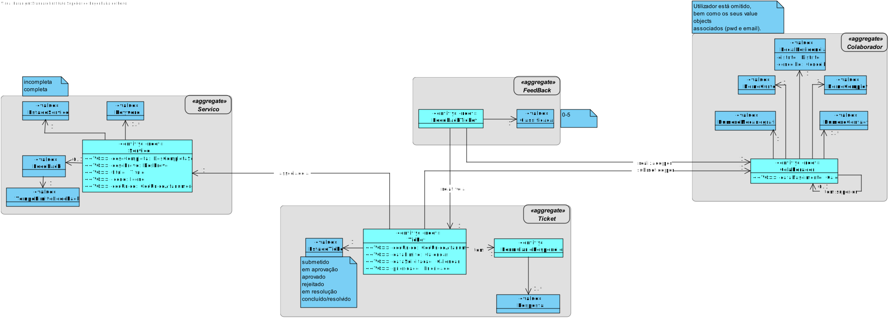
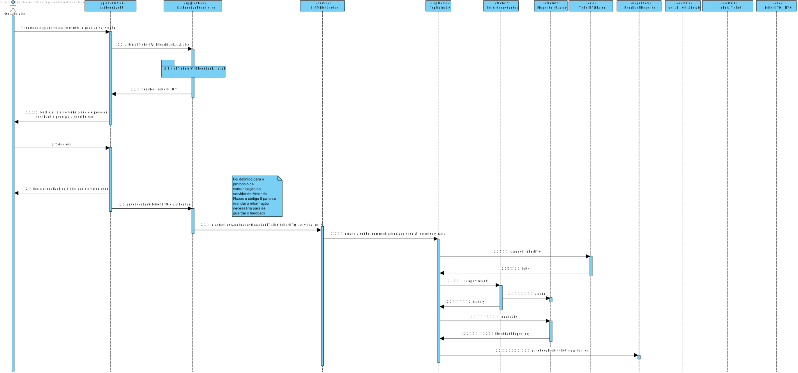

# US3051 - Transmitir o meu grau de satisfação sobre a resolução de um dado pedido por mim efetuado
===================================================================

# 1. Requisitos

**US3051:**

* Como **Utilizador**, eu pretendo **transmitir o meu grau de satisfação** sobre a **resolução de um dado pedido** por mim efetuado.

* A interpretação feita deste requisito foi no sentido de um colaborador poder **dar feedback** sobre o seu **grau de satisfação** relativamente à **satisfação ou não** do seu **pedido**. Esta
funcionalidade apenas deve estar disponível para **alguns serviços**.

# 2. Análise

## Excerto do Modelo de Domínio

# 3. Design

## 3.1. Realização da Funcionalidade

* SD_US3051

* SD_allFinishTicketsWithFeedbackAvailable()

.svg)

## 3.2. Diagrama de Classes

* (não é necessário)

## 3.3. Padrões Aplicados

- Controller

- Creator

- Repository

- Factory

- Persistence Context

- DTO

# 4. Dados do Servidor Motor de Fluxos

* Os dados relativos ao **servidor**, tanto o **IP** como a **Porta** a ser utilizada, encontram-se presentes no ficheiro ***application.properties*** (HelpdeskService/helpdesk.core/src/main/resources/application.properties) da aplicação ***helpdesk.core*** (HelpdeskService/helpdesk.core).

  | Server IP | Server Port | Trusted Store        | Keys Store Pass |
  |:--------- |:----------- |:-------------------- |:--------------- |
  |10.9.21.88 |2021         |serverMotorFluxos.jks |forgotten        |

# 5. Fluxo de Troca de Mensagens entre o Cliente e o Servidor

## 5.1. Buscar a Lista de Tickets que pode dar Feedback

1. **Manda** ao **Servidor** o **Código de Teste (0)**.
2. **Espera** pela mensagem do **Servidor** com o **Código de Entendido (2)**.
3. **Manda** ao **Servidor** o **Código de Lista de Tickets que pode dar Feedback (8)**.
4. **Espera** pela mensagem do **Servidor** com o **Código de Entendido (2)**.
5. **Envia o Colaborador** para o **Servidor**.
6. **Espera** pela lista com os **tickets**, que o colaborador pode **dar feedback**, do **Servidor**.
7. **Manda** ao **Servidor** o **Código de Fim (1)**.
8. **Espera** pela mensagem do **Servidor** com o **Código de Entendido (2)**.
9. **Fecha** o Socket.

* (**NOTA**: Caso exista algum problema durante a troca de mensagens o **socket é fechado**)

## 5.2. Guardar Feedback do Utilizador de um Ticket

1. **Manda** ao **Servidor** o **Código de Teste (0)**.
2. **Espera** pela mensagem do **Servidor** com o **Código de Entendido (2)**.
3. **Manda** ao **Servidor** o **Código de Guardar Feedback (9)**.
4. **Espera** pela mensagem do **Servidor** com o **Código de Entendido (2)**.
5. **Envia o Ticket** para o **Servidor**.
6. **Envia a Classificação** para o **Servidor**.
7. **Manda** ao **Servidor** o **Código de Fim (1)**.
8. **Espera** pela mensagem do **Servidor** com o **Código de Entendido (2)**.
9. **Fecha** o Socket.

* (**NOTA**: Caso exista algum problema durante a troca de mensagens o **socket é fechado**)

# 6. Implementação

* Foi utilizado o **Padrão DTO**.
* Foi utilizado o **Protocolo de Comunicação SDP2021**.
* Ficheiro de Configurações: **application.properties**.
* Todos os **tipos de erros** durante a **troca de mensagens**, que possam surgir, são completamente **verificados**.
* Foram utilizados **certificados** para que exista uma **comunicação segura** entre o servidor e o cliente.

# 7. Integração/Demonstração

* Esta **US** está relacionada com a **US4001 (Motor de Fluxos de Atividades)**, pois é esta que vai enviar a **Lista de Tickets** que um utilizador pode dar feedback e que, se desejar dá-lo, será o servidor que irá **guardar** o seu feedback.
* Esta **US** está também relacionada com a **US3023 (Realizar Tarefas Pendentes)**, pois para que seja possível dar o **Feedback** é necessário que as **tarefas** do mesmo sejam **realizadas previamente**.

# 8. Observações

* -
