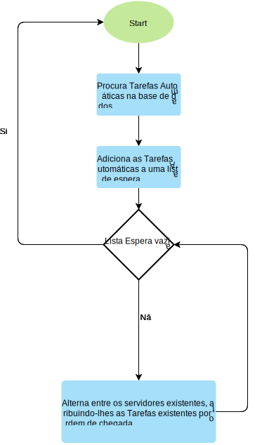

# US4071 - Algoritmos de distribuição de tarefas automáticas pelas diversas instâncias do Executor de Tarefas Automáticas (Algoritmo 1)
=======================================================================================================

# 1. Requisitos

**US4071:**

* Como **Gestor de Projeto**, eu pretendo que seja desenvolvido e integrado no Motor de Fluxos de Atividades, **algoritmos que distribuam a realização de tarefas automáticas** pelas diversas **instâncias do Executor de Tarefas Automáticas**.

# 2. Dados dos Servidores

## 2.1. Servidor do Motor de Fluxos

| Server IP  | Server Port |
|:---------- |:----------- |
|10.9.21.88  |2021         |

## 2.2. Servidores do Executor de Tarefas automáticas

|Server Number | Server IP  | Server Port |
|:------------ |:---------- |:----------- |
|1             |10.9.21.109 |2020         |
|2             |10.9.21.172 |2020         |

# 3. Fluxograma

# 4. Implementação

* O nosso grupo definiu que a carga suportada por cada servidor é **1 Tarefa Automática**.
* O código encontra-se na Classe **TcpCliMotor** (HelpdeskService/helpdesk.app.motorDeFluxos/src/main/java/eapli/helpdesk/app/MotorDeFluxos/TcpMotor/TcpCliMotor.java)
* Ficheiro de Configurações: **application.properties** (HelpdeskService/helpdesk.app.motorDeFluxos/src/main/resources/application.properties).

# 5. Integração/Demonstração

* Esta US está relacionada com a **US5003 (Executor de Tarefas Automáticas)**, ou seja quando o Motor de Fluxos de Atividades encontrar uma Tarefa Automática vai verificar se algum dos **Servidores do Executor de Tarefas Automáticas (1 ou 2)** se encontra disponível para executar uma Tarefa, e se assim manda a tarefa para esse servidor.

# 6. Observações
[INFO] O Algoritmo de Execução 1 demorou 9 segundos a executar 4 Tarefas Automáticas
*
