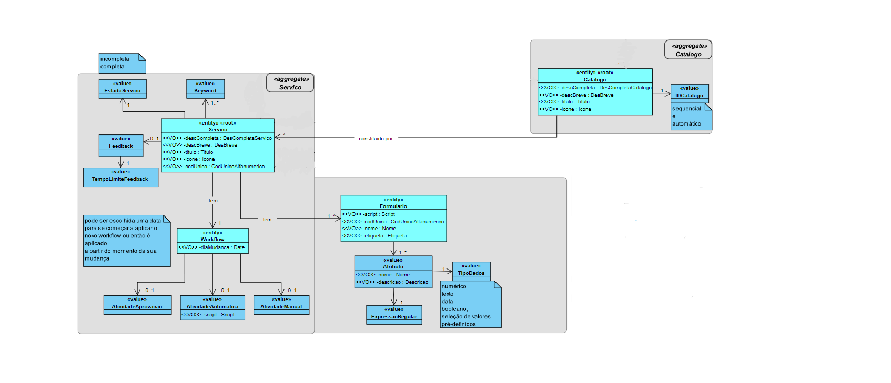

# USDemo4
=======================================

# 1. Requisitos

**USDemo4** Como Gestor de Serviços de Help desk (GSH), eu pretendo criar um novo catálogo de serviços.

- Demo4.1. Além dos atributos base, a criação de um novo catálogo inclui a indicação de um colaborador responsável e uma lista de equipas associadas ao mesmo.

A interpretação feita deste requisito foi no sentido de disponibilizar, de forma simples e eficaz, a criação de um catálogo com os seus respetivos atributos.

# 2. Análise

Com o intuito de organizar, perceber melhor e tomar as mehores decisões para como iria funcionar a implementação, disponibilizei um Md para cada uma das US pertencentes ao sprint B: (USDemo4 E USDemo8).

# 3. Design

MD Us_Demo4:

## 3.1. Realização da Funcionalidade

Primeiramente, o UI pede ao gestor que insira os parâmetros necessários para a criação do catálogo (possuindo estes as suas verificações).
Após isto, o controller instancia o catálogo e leva-o para o construtor.
Seguidamente, na classe catálogo, o objeto é criado.
Finalmente, é adicionado à base de dados com os respetivos atributos.

## 3.2. Diagrama de Classes

AddCatalogoUI
AddCatalogoController
Catalogo (entidade)
DescricaoBreve (Value Object)
DescricaoCompleta (Value Object)
Id (Value Object)
Titulo (Value Object)
DescricaoBreveException (Exception)
DescricaoCompletaException (Exception)
IdException (Exception)
TituloException (Exception)
CatalogoRepository (Repositorio)
InMemoryCatalogoRepository (Repositorio em memória)
JpaCatalogoRepository (Repositorio em jpa)

## 3.3. Padrões Aplicados

O design desta US foi realizado após a implementação (excepto MD), visto que esta poderia vir a sofrer algumas alterações.

## 3.4. Testes
Testes não implementados.

# 4. Implementação

Exemplos de implementação da criação de um catálogo:

UI (introdução do ID):

while(i==0) {
            try {
                id = Console.readInteger("Id do Catálogo:");
                this.theController.registerId(id);
                i++;
            } catch (IdException idException) {
                System.out.println("Id inválido. Por favor insira um Id válido.");
                i=0;
            }
        }

Controller (registo do ID):

public Id registerId(int id) throws IdException {
        return new Id(id);
        }

Catalogo (registo de um catálogo após introdução de todos os parâmetros):

public Catalogo(final Id id, final DescricaoBreve descBreve, final DescricaoCompleta descCompleta, final Titulo titulo, final byte[] image, Collaborator colabRes, Criticidade criticidade, List<Team> equipas) {
        this.id = id;
        this.descBreve = descBreve;
        this.descCompleta = descCompleta;
        this.titulo = titulo;
        this.colabRes = colabRes;
        this.criticidade = criticidade;
        this.equipas = equipas;
        Preconditions.nonNull(image);

        changeImage(image);
    }

Obs: Para a criação de um catálogo, é necessário existir um icone associado ao mesmo.
Assim, foram utilizados como modelo base do projeto "eCafetaria", os métodos e classes (alterados em conformidade com o atual projeto) referentes à implementação deste parâmetro.

# 5. Integração/Demonstração

Na criação de um catálogo, estão inerentes muitas outras funcionalidades e classes, que terão de estar previamente definidas para que este se possa executar.
Disto é exemplo:
- O colaborador responsavel pelo Catálogo;
- Lista de equipas que futuramente irão possuir acesso ao Catálogo.

# 6. Observações

Nesta US é possivel encontrar vestígios de implementação que estariam presentes na classe "Allergen" do projeto "eCafetaria"
Apenas existe um icone disponivel "images/gluten.jpg". Este serviu de modelo e teste para a integração dos icones em catálogos.
Esta imagem está presente no projeto "eCafetaria".
