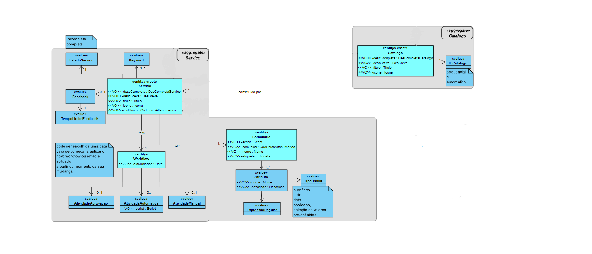

# USDemo8
=======================================

# 1. Requisitos

**Demo8:**

* Como utilizador, eu pretendo **consultar/pesquisar os catálogos de serviços e respetivos serviços** que me estão/são disponibilizados.

* A interpretação feita deste requisito foi no sentido de conseguir pesquisar eficazmente por um catálogo ou serviços, partindo de diferentes atributos(e.g. Titulo do catálogo/servico, Id catálogo, etc...)

# 2. Análise

## Excerto do Modelo de Domínio

Com o intuito de organizar, perceber melhor e tomar as mehores decisões para como iria funcionar a implementação, disponibilizei um Md para cada uma das US pertencentes ao sprint B: (USDemo4 E USDemo8).

# 3. Design

MD Us_Demo8:

## 3.1. Realização da Funcionalidade

Primeiramente, o UI pede ao utilizador que insira os parâmetros necessários para a pesquisa de catálogos ou serviços (possuindo estes as suas verificações).
Após isto, o controller da opção escolhida verifica na lista de catálogos/serviços referente à base de dados se o atributo introduzido faz parte da lista em questão.
Seguidamente, é criada uma lista clonada da lista retornada pelo método findAll() e são pesquisados nessa lista os atributos inseridos.
Finalmente, o programa apresenta os resultados obtidos pela respetiva pesquisa.

## 3.2. Diagrama de Classes

(Classes referentes à pesquisa de catálogos)
PesquisarCatalogoColabUI (User Interface)
PesquisarCatalogoCritUI (User Interface)
PesquisarCatalogoIdUI (User Interface)
PesquisarCatalogoTituloUI (User Interface)
AddCatalogoController (Controller)

(Classes referentes à pesquisa de serviços)
PesquisarServicoCodigoUI (User Interface)
PesquisarServicoTempoFeedbackUI (User Interface)
PesquisarServicoTituloUI (User Interface)
AddServicoController (Controller)

## 3.3. Padrões Aplicados

O design desta US foi realizado após a implementação (excepto MD), visto que esta poderia vir a sofrer algumas alterações.

## 3.4. Testes
Testes não implementados.

# 4. Implementação

Exemplos de implementação da pesquisa de um catálogo/serviço(Catalogo por nivel de Criticidade):

UI (introdução do nivel de criticidade):

protected boolean doShow() {
        int i = 0, j=0;
        String crit = null;

        while (i == 0) {
            crit = Console.readLine("Nivel de Criticidade:");
            System.out.println("Resultados obtidos que possuem a Criticidade: " + crit);
            for (Catalogo catalogo : theController.allCatalogos()) {
                if (catalogo.getCriticidade().toString().equalsIgnoreCase(crit)) {
                    System.out.println(catalogo);
                    j++;
                }
            }
            if(j==0){
                System.out.println("Lista de Catálogos com nivel de criticidade " + crit + " vazia!");
            }
            i++;
        }
        return false;
    }

		Controller (busca da lista referente aos catálogos)

		public List<Catalogo> allCatalogos(){
        List<Catalogo> lista = new ArrayList<>();
        for (Catalogo catalogo:catalogoRepository.findAll()) {
            lista.add(catalogo);}
        return lista;
    }

Controller (presentação dos dados pedidos)

for (Catalogo catalogo : theController.allCatalogos()) {
		if (catalogo.getCriticidade().toString().equalsIgnoreCase(crit)) {
				System.out.println(catalogo);
				j++;
		}

# 5. Integração/Demonstração

Na pesquisa de um catálogo ou serviço, estão inerentes muitas outras funcionalidades e classes, que terão de estar previamente definidas para que este se possa executar.
Disto é exemplo:
- Ter os serviços previamente criados e disponiveis (apesar da confirmação presente se não existerem);
- Ter os catálogos previamente criados e disponiveis (apesar da confirmação presente se não existerem);

# 6. Observações
